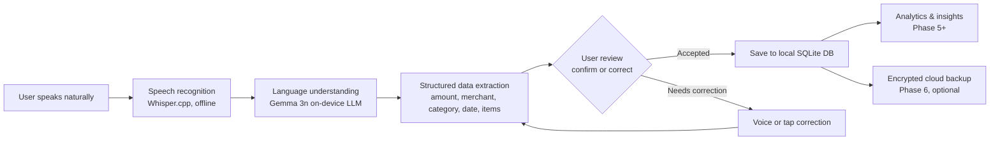
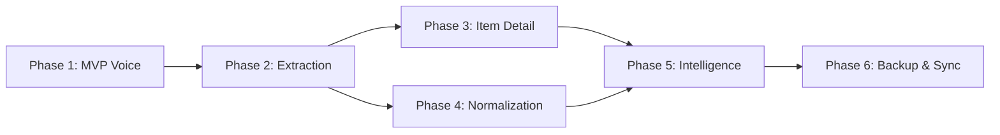

# Masroof (مصروف) — Voice-First Personal Finance Assistant

**Business Requirements Document (BRD)**

| Document Control | |
|---|---|
| **Document ID** | BRD-001 |
| **Version** | 2.0 |
| **Status** | Draft for Review |
| **Date** | 2026-06-13 |
| **Author** | Product Team |
| **Classification** | Internal — Confidential |

**Change History**

| Version | Date | Author | Summary of Changes |
|---|---|---|---|
| 1.0 | 2026-06-13 | Product Team | Initial draft (summary) |
| 2.0 | 2026-06-13 | Product Team | Full BRD: added smart reminders, adaptive timing, spending pulse, revenue model, GTM strategy, localization requirements, competitive positioning, prioritization logic, expanded non-functional requirements |

---

## Table of Contents

1. [Executive Summary](#1-executive-summary)
2. [Business Context & Market Opportunity](#2-business-context--market-opportunity)
3. [Product Vision & Strategic Alignment](#3-product-vision--strategic-alignment)
4. [Target Audience & User Personas](#4-target-audience--user-personas)
5. [Solution Overview](#5-solution-overview)
6. [Core Design Principles](#6-core-design-principles)
7. [Product Requirements by Phase](#7-product-requirements-by-phase)
8. [Non-Functional Requirements](#8-non-functional-requirements)
9. [Technical Architecture Summary](#9-technical-architecture-summary)
10. [Release Strategy & Go-to-Market](#10-release-strategy--go-to-market)
11. [Revenue Model & Monetization](#11-revenue-model--monetization)
12. [Success Metrics & KPIs](#12-success-metrics--kpis)
13. [Risks, Assumptions & Dependencies](#13-risks-assumptions--dependencies)
14. [Competitive Positioning](#14-competitive-positioning)
15. [Localization Requirements](#15-localization-requirements)
16. [Prioritization Logic & Trade-offs](#16-prioritization-logic--trade-offs)
17. [Glossary](#17-glossary)
18. [Appendices](#18-appendices)

---

## 1. Executive Summary

Masroof (مصروف — Arabic for "expense" or "allowance") is a **voice-first personal finance assistant** purpose-built for the Egyptian market. It eliminates the single greatest barrier to personal financial management: **data entry friction**.

Traditional expense tracking applications demand that users become amateur accountants — opening forms, filling fields, selecting dropdowns, assigning categories, and manually correcting inconsistencies. Unsurprisingly, over 95% of users abandon these apps within weeks.

Masroof inverts this paradigm. Users speak naturally — _"I bought groceries from Carrefour for 450 pounds"_ — and the application transcribes, understands, categorizes, and stores the expense in **under 10 seconds**. No forms. No dropdowns. No friction.

**Core value proposition:** Record an expense in the time it takes to say it.

The product is architected as a **local-first, AI-native, offline-capable** mobile application targeting iOS and Android via a single React Native codebase. On-device speech recognition (Whisper.cpp) and a small language model (Gemma 3n) provide intelligent parsing without compromising user privacy or requiring constant internet connectivity.

This document defines the complete business requirements across six phased releases, from an MVP focused on voice-to-ticket recording through advanced financial intelligence, data normalization, and encrypted cloud backup. It is intended for executive leadership, engineering teams, investors, and cross-functional stakeholders.

---

## 2. Business Context & Market Opportunity

### 2.1 The Problem: Expense Tracking Has Unsolvable Friction

Personal finance management suffers from a fundamental adoption problem. Despite widespread awareness of its importance, the vast majority of smartphone users do not track their expenses. The root cause is not lack of interest — it is **data entry friction**.

Traditional applications assume a level of user discipline that contradicts real-world behavior:

- **Users are busy** — they will not open an app and navigate forms mid-transaction.
- **Users forget** — by the end of the day, the ₹45 coffee or the 120 EGP taxi ride is lost to memory.
- **Users are inconsistent** — manual data entry degrades in quality over time as shortcuts, typos, and abbreviations accumulate.
- **Users avoid repetitive tasks** — the cognitive load of categorization, tagging, and reconciliation causes abandonment.

**The result:** Incomplete records, missing expenses, unreliable analytics, and ultimately, abandoned applications. The personal finance app market is littered with well-designed products that failed不是因为 their features, but because their interaction model demanded more effort than users were willing to invest.

### 2.2 The Data Quality Problem Compounds Over Time

Even among the small minority who persist with manual tracking, data quality degrades rapidly. A single merchant may be recorded in multiple inconsistent forms:

| Variant | Language | Script |
|---|---|---|
| McDonald's | English | Latin |
| Mcdonalds | English | Latin (typo) |
| ماكدونالدز | Arabic | Arabic |
| ماك | Arabic | Arabic (colloquial) |

Similarly, an Uber ride may be logged as "Uber", "Uber Ride", "Transportation", "Taxi", or "مواصلات". This fragmentation means that even the most diligent user ends up with analytics that are unreliable, reports that are misleading, and insights that are unattainable.

**The normalization problem is not a user problem — it is a system problem.** The application should handle consistency; the user should only speak.

### 2.3 Most Financial Apps Lack Contextual Intelligence

Existing budgeting and expense tracking apps share a common failure mode: they present **data without context**. A typical app tells the user:

> *"You spent 5,000 EGP on Food this month."*

But it cannot answer:

- Which specific restaurants drove the increase?
- Which products are becoming more expensive over time?
- Which of these purchases are recurring necessities versus discretionary?
- What concrete, actionable step would reduce spending most effectively?

Users receive **numbers** — not **guidance**. Masroof's long-term vision is to close this gap by transforming raw transactional data into personalized, actionable financial intelligence.

### 2.4 Market Landscape & Gap Analysis

| Segment | Representative Players | Gap |
|---|---|---|
| **Traditional expense trackers** | Monefy, Spendee, Bluecoins, Wallet by BudgetBakers | High data-entry friction; form-heavy UX; high abandonment rates; none optimized for Arabic |
| **Budgeting apps** | YNAB, Mint, PocketGuard | Generic insights; rigid budgeting frameworks; no personalization; US-centric |
| **Banking apps** | CIB, QNB, Banque Misr mobile apps | Transaction history only; no proactive intelligence; no spending categorization; no voice input |
| **AI finance assistants (global)** | Cleo, Plum, Chip | Not localized for Arabic/Egyptian market; cloud-dependent; limited offline capability |
| **Arabic finance apps** | M3amali, Malomaty, Ehtesaby | Manual entry only; no voice or AI capabilities; basic reporting |

**Masroof occupies a unique and defensible position:** voice-first interaction + local-first architecture + AI-native intelligence + deep Arabic language support + Egyptian market focus. No existing competitor combines all five attributes.

### 2.5 TAM, SAM & SOM

| Metric | Estimate | Basis |
|---|---|---|
| **TAM** (Egyptian smartphone users) | ~65M | Egypt: ~105M population, ~62% smartphone penetration (2026 est.) |
| **SAM** (adults 18–55 interested in finance management) | ~25M | 40% of smartphone users express interest in budgeting/spending tracking |
| **SOM** (Phase 1 target, Year 1) | 100K–250K users | Conservative: 0.4–1% of SAM, validated through organic + paid acquisition |

*Note: These estimates should be refined through market research and pilot data.*

---

## 3. Product Vision & Strategic Alignment

### 3.1 Vision Statement

> **To become the intelligent personal finance operating system for the Arabic-speaking world — starting with Egypt.**

Masroof is not merely an expense tracker. The long-term vision is a product that evolves through increasing levels of autonomy:

| Level | Capability | Phase |
|---|---|---|
| **1. Record** | User speaks → system records and transcribes | Phase 1 |
| **2. Understand** | System extracts structured data from natural speech | Phase 2–3 |
| **3. Organize** | System normalizes, deduplicates, and categorizes automatically | Phase 4 |
| **4. Analyze** | System identifies patterns, trends, and anomalies | Phase 5 |
| **5. Advise** | System recommends actions, predicts spending, and helps users save | Phase 5 |
| **6. Anticipate** | System proactively alerts users to financial opportunities and risks | Future |

### 3.2 Strategic Pillars

1. **Zero-friction recording** — The fastest possible path from purchase to record.
2. **Local-first architecture** — User data is private by default; cloud is optional.
3. **AI-native intelligence** — Machine understanding replaces manual organization.
4. **Arabic-first design** — Language, culture, and market preferences are not afterthoughts.
5. **Incremental value delivery** — Each phase produces a shippable, valuable product.

### 3.3 Alignment with Business Objectives

| Business Objective | How Masroof Contributes |
|---|---|
| **User acquisition** | Novel voice-first approach generates organic interest and word-of-mouth |
| **User retention** | Habit-forming reminders and growing intelligence create stickiness |
| **Data moat** | Normalized spending data becomes a defensible asset over time |
| **Revenue generation** | Premium tier, insights, and backup services (see Section 11) |
| **Market leadership** | First-mover in Arabic voice-finance with expanding feature advantage |

---

## 4. Target Audience & User Personas

### 4.1 Primary Persona — The Busy Professional

> *"I know I should track my spending, but I don't have time to open an app and fill out forms every time I buy something."*

| Attribute | Detail |
|---|---|
| **Age** | 25–45 |
| **Income** | Middle to upper-middle class (15,000–50,000+ EGP/month household) |
| **Occupation** | White-collar professional, manager, entrepreneur, engineer, doctor |
| **Location** | Cairo, Alexandria, Giza — urban and suburban |
| **Behavior** | Smartphone-dependent; makes 3–10 casual purchases daily (coffee, meals, transport, groceries); uses Arabic and English interchangeably in speech |
| **Pain point** | Wants financial awareness without administrative overhead; has tried and abandoned other expense trackers |
| **Value proposition** | Tap mic, speak, done. Zero friction. No forms. |
| **Motivation** | Control over spending, peace of mind, avoiding surprises at month-end |

### 4.2 Secondary Personas

| Persona | Age | Profile | Need | Example Use Case |
|---|---|---|---|---|
| **Freelancer** | 22–40 | Remote worker, gig economy, creative professional | Separating personal & business spending; tax preparation support | "Paid 300 EGP for domain renewal" → auto-categorized as business expense; end-of-month business spending report |
| **University Student** | 18–24 | Dependent on allowance/part-time income; first-gen smartphone user | Budget control; spending awareness; building financial literacy | Tracking daily allowances; identifying overspend patterns; learning to budget |
| **Family Manager** | 30–55 | Household financial decision-maker; often a parent managing family expenses | Multi-person, multi-category household tracking; shared visibility | "Bought school supplies for 800 EGP", "Paid electricity bill 1,200 EGP"; reviewing aggregate family spending patterns |
| **Expats & Diaspora** | 25–50 | Egyptians living abroad sending remittances; dual-currency lifestyle | Managing expenses across currencies; remittance tracking | Recording expenses in EUR/GBP/USD with automatic EGP conversion; tracking remittance frequency and fees |

### 4.3 Demographic Context (Egyptian Market)

- **Language behavior:** Code-switching between Arabic (Egyptian colloquial) and English is ubiquitous among the target demographic. A typical utterance might be: *"دفعت ٢٠٠ على Uber بس"* or *"I bought milk and عيش from Metro for 150"*. The system must handle mixed-language input gracefully.
- **Currency:** Egyptian Pound (EGP, ج.م). Numerals must display in Eastern Arabic (٠١٢٣٤٥٦٧٨٩) by default, with Western numerals as an option.
- **Cultural factors:** Friday is the weekend. Pay cycles are often monthly (government salaries) or irregular (private sector, freelance). Ramadan shifts daily rhythms significantly — meal times, shopping patterns, and sleep schedules all change.

---

## 5. Solution Overview

### 5.1 How It Works



### 5.2 Key Capabilities

| Capability | Description | Technology | Phase |
|---|---|---|---|
| **Speech recognition** | Converts Arabic, English, and mixed speech to text; works fully offline | Whisper.cpp | 1 |
| **Natural language understanding** | Parses financial intent from casual, unstructured speech | Gemma 3n | 2 |
| **Structured data extraction** | Identifies amount, merchant, category, date, and optional items | Gemma 3n + post-processing | 2–3 |
| **Intelligent categorization** | Predicts expense category automatically based on merchant, amount, and context | ML classifier + rules | 2 |
| **Data normalization** | Unifies merchant, category, and product names into canonical forms | LLM + rule-based hybrid | 4 |
| **Financial analytics** | Dashboards, trends, breakdowns, and personalized saving recommendations | Local aggregation engine | 5 |
| **Smart reminders** | Adaptive notification system with suppression logic and deep-linking | Local push notifications | 1, enhanced in 5 |

### 5.3 Input → Output Examples

**Example 1 — Simple expense (Arabic, mixed language):**

> **Input (voice):** *"دفعت ٤٥٠ جنيه في Carrefour على أكل البيت"*

**Extracted output:**
```json
{
  "amount": 450,
  "currency": "EGP",
  "merchant": "Carrefour",
  "category": "Groceries",
  "date": "2026-06-13",
  "confidence": 0.94,
  "transcript": "دفعت ٤٥٠ جنيه في Carrefour على أكل البيت"
}
```

**Example 2 — Itemized expense:**

> **Input (voice):** *"اشتريت لبن ب٤٠ وعيش ب٢٠ وجبنة ب٨٠ من Metro"*

**Extracted output:**
```json
{
  "merchant": "Metro Market",
  "total": 140,
  "currency": "EGP",
  "items": [
    { "name": "لبن (Milk)", "price": 40, "category": "Dairy" },
    { "name": "عيش (Bread)", "price": 20, "category": "Bakery" },
    { "name": "جبنة (Cheese)", "price": 80, "category": "Dairy" }
  ],
  "date": "2026-06-13"
}
```

**Example 3 — Correction via voice:**

> **Input (voice, on review screen):** *"لا، دي مش أكل — دي أدوات مكتبية"*

**System action:** Re-categorizes the expense from "Food" to "Office Supplies" and updates the confidence score.

---

## 6. Core Design Principles

These principles govern every product and engineering decision. They are non-negotiable.

### 6.1 Voice First

The primary interaction mode is voice. Text entry exists but is strictly secondary. Every screen, flow, and notification is optimized around the assumption that users will primarily speak. This means:

- The microphone is always one tap away (or one notification tap).
- Voice can be used to correct errors on the review screen.
- Confirmation dialogues are minimal — the system acts, and the user overrides only when needed.

### 6.2 Minimal Friction

The ideal user flow is three steps:

```
Open App → Tap Microphone → Speak → Done
```

No forms. No dropdowns. No complicated interfaces. Every additional tap is a defect. The target time from app open to expense saved is **under 10 seconds** (median).

### 6.3 Local First

User data belongs to the user. The application functions fully without internet access. Core functionality — recording, transcribing, extracting, storing, browsing, and analyzing — works entirely offline. Cloud connectivity is optional and used only for encrypted backup and multi-device sync (Phase 6).

### 6.4 AI Assisted, Not AI Replacing

AI reduces user effort — it does not remove user agency. The system automates understanding, categorization, and organization, but users always have the final say. The review screen is a safety net, not a required step. Confidence thresholds determine whether the system saves automatically or requests confirmation.

### 6.5 Privacy by Design

- All speech recognition and language understanding runs **on-device**. No audio or transcript data leaves the device unless the user explicitly initiates a backup.
- Cloud backups are **end-to-end encrypted**: encryption happens on-device before upload; the server stores only ciphertext.
- No data is shared with third parties for advertising, model training, or analytics without explicit opt-in.

### 6.6 Progressive Intelligence

Each phase of the product builds on the data and capabilities of the previous phase. The system becomes smarter over time as it accumulates normalized, high-quality expense data. This creates a **data network effect** — the more a user interacts with Masroof, the more accurate and personalized the experience becomes.

### 6.7 Arabic First, Globally Aware

- UI text is authored in Arabic (Egyptian localization) with English as a secondary language.
- Numerals display in Eastern Arabic (٠١٢٣٤٥٦٧٨٩) by default.
- All layouts are right-to-left (RTL).
- Speech recognition handles Egyptian Arabic, Modern Standard Arabic, English, and code-switching between them.

---

## 7. Product Requirements by Phase

This section defines detailed functional requirements for each of the six planned phases. Requirements are structured as capabilities with acceptance criteria.

### 7.1 Phase 1 — MVP: Voice to Ticket

**Objective:** Validate that users will record expenses via voice. Deliver a functional end-to-end voice recording and playback experience, even without structured extraction.

**Duration estimate:** 8–10 weeks

#### 7.1.1 Core Features

| ID | Requirement | Acceptance Criteria | Priority |
|---|---|---|---|
| REQ-1.1 | **Voice Recording** — User can record a voice note by tapping a prominently placed microphone button | 1. Microphone button is visible on the home screen<br/>2. Tap starts recording immediately (no permission gate on subsequent uses)<br/>3. Recording shows real-time audio waveform<br/>4. Recording stops on tap or silence detection (configurable timeout) | P0 |
| REQ-1.2 | **Speech Transcription** — Audio is transcribed to text using on-device Whisper.cpp | 1. Transcription appears in real-time or within 2 seconds of stopping<br/>2. Supports Arabic (Egyptian dialect), English, and code-switched input<br/>3. Works fully offline — no network request made<br/>4. Original audio file is retained alongside transcript | P0 |
| REQ-1.3 | **Ticket Creation & Storage** — Every voice note is stored as a "ticket" (raw recording + transcript pair) in local SQLite | 1. Ticket includes: UUID, audio file path, transcript text, timestamp, duration<br/>2. Tickets persist across app restarts<br/>3. Storage is local only — no cloud dependency | P0 |
| REQ-1.4 | **Ticket History** — Users can browse, search, and edit transcript text | 1. Chronological list view with date grouping<br/>2. Search by text across all transcripts<br/>3. Tap to view detail; edit transcript inline<br/>4. Delete individual tickets | P1 |
| REQ-1.5 | **Offline Operation** — All features work without internet | 1. No functionality degrades or hides when offline<br/>2. No forced account creation or login required during onboarding<br/>3. Permissions (microphone, notifications) requested contextually | P0 |

#### 7.1.2 Smart Reminder System

*New in Phase 1 — designed to build the habit of voice recording from day one.*

**Rationale:** Habit formation is the single biggest risk for Phase 1. Users who forget to use the app in the first week will likely never return. The reminder system is designed to be **gentle, intelligent, and non-intrusive** — prompting users at natural pause points in their daily rhythm.

| ID | Requirement | Acceptance Criteria | Priority |
|---|---|---|---|
| REQ-1.6 | **Onboarding Reminder Setup** — During initial onboarding, users configure 1–3 daily reminder slots | 1. Onboarding flow presents reminder configuration as an optional step<br/>2. Default slots: After lunch (1:30 PM), Evening commute (7:00 PM), Before bed (9:30 PM)<br/>3. User can customize time for each slot<br/>4. User can choose 1, 2, or 3 slots (minimum 1 to proceed, or "skip")<br/>5. Times are configurable later via Settings | P1 |
| REQ-1.7 | **Suppression Logic** — Reminders are suppressed if the user has already logged an expense within the last 2 hours | 1. Before firing a reminder, system checks if any expense was recorded in the preceding 120 minutes<br/>2. If yes → suppress this reminder and reset the suppression window<br/>3. Suppression is per-slot, not daily — a suppressed 1:30 PM reminder does not cancel 7:00 PM<br/>4. Suppression logic is checked locally (no server needed) | P1 |
| REQ-1.8 | **Deep-Link to Microphone** — Tapping the notification opens the app directly to the microphone recording screen | 1. Notification tap navigates directly to recording UI — no interstitial, no dashboard<br/>2. If app is already open, notification tap focuses existing recording UI<br/>3. No login or splash screen delay | P1 |
| REQ-1.9 | **Daily Reminder Cap** — Maximum 3 reminders per day, regardless of configuration | 1. System enforces an absolute cap of 3 notifications per day<br/>2. Reminder is dismissible with a single swipe/tap<br/>3. No sound/vibration outside user-defined quiet hours (configurable) | P1 |
| REQ-1.10 | **Reminder Nudge Content** — Notification text is contextual and non-generic | 1. Default text variants (rotated to avoid habituation):<br/>   - "Time to log your expenses? 🎤"<br/>   - "What did you spend today? Tap to record."<br/>   - "Don't let your purchases pile up — 10 seconds is all it takes."<br/>2. Users can customize notification text (future phase) | P2 |

#### 7.1.3 Phase 1 Success Criteria

| Metric | Target | Measurement |
|---|---|---|
| **Voice recording retention** | >60% of users record ≥3 expenses in the first 7 days | Analytics — recording events per user |
| **Onboarding completion rate** | >80% of installs complete onboarding (including reminder setup) | Funnel analytics |
| **Time to first recording** | <120 seconds from first app open | Analytics — session timing |
| **Reminder opt-in rate** | >70% of users accept at least one reminder slot | Onboarding analytics |
| **Crash-free session rate** | >99.5% | Crash reporting |
| **Offline reliability** | 100% of core features functional without connectivity | Automated testing |

---

### 7.2 Phase 2 — Structured Extraction

**Objective:** Convert raw transcripts into structured, usable expense records through on-device NLU. Introduce the review screen and voice correction.

**Duration estimate:** 6–8 weeks

| ID | Requirement | Acceptance Criteria | Priority |
|---|---|---|---|
| REQ-2.1 | **Information Extraction** — Gemma 3n parses transcript into structured fields: amount, currency, merchant, category, date | 1. Extraction runs on-device within 3 seconds of transcription completion<br/>2. Supports Arabic, English, and mixed-language transcripts<br/>3. Handles implicit dates ("today", "yesterday", "امبارح", "الجمعة اللي فاتت")<br/>4. Handles implicit merchants ("bought groceries" → merchant = null, category = Groceries)<br/>5. Outputs confidence score per field and overall | P0 |
| REQ-2.2 | **Review Screen** — User verifies extracted information before saving | 1. Card-style layout showing amount, merchant, category, date as editable chips<br/>2. Swipe-to-confirm gesture for quick acceptance<br/>3. Each field is tappable for manual editing<br/>4. Original transcript shown for reference<br/>5. "Auto-save" mode (optional) skips review for high-confidence extractions | P0 |
| REQ-2.3 | **Voice Correction** — User can correct any field by voice on the review screen | 1. Tap a field → voice input mode activates<br/>2. Say: "change category to food" or "المبلغ ٥٠٠ مش ٤٠٠"<br/>3. System updates the specific field, re-checks consistency<br/>4. Falls back to keyboard if voice correction fails | P1 |
| REQ-2.4 | **Structured Expense Storage** — Parsed expenses stored as structured records linked to original ticket | 1. Schema: expense_id, ticket_id, amount, currency, merchant, category, date, confidence, items (null), created_at, updated_at<br/>2. Original ticket is preserved and linked — no data loss<br/>3. Indexed for fast query by date, category, merchant | P0 |
| REQ-2.5 | **Extraction Accuracy Testing** — Ground-truth test set for ongoing evaluation | 1. Curate test set of 500+ real Egyptian Arabic utterances with canonical JSON labels<br/>2. Automated accuracy reporting per field: amount, merchant, category, date<br/>3. Success target: >80% overall field-level accuracy | P1 |

#### 7.2.1 Phase 2 Success Criteria

| Metric | Target |
|---|---|
| **Extraction accuracy** (field-level, weighted) | >80% |
| **Review screen acceptance rate** | >85% of displayed extractions accepted without edits |
| **Voice correction success rate** | >70% of voice correction attempts succeed |
| **Conversion rate** (ticket → structured expense) | >60% of Phase 1 tickets get structured in Phase 2 |

---

### 7.3 Phase 3 — Item-Level Detail

**Objective:** Capture spending at the individual product level — what items were purchased, at what price, and from where. Enable subcategory hierarchies and product-level analytics.

**Duration estimate:** 8–10 weeks

| ID | Requirement | Acceptance Criteria | Priority |
|---|---|---|---|
| REQ-3.1 | **Itemized Extraction** — Parse multi-item voice notes into individual line items with prices | 1. Extract items from natural speech: "milk for 40, bread for 20, cheese for 80"<br/>2. Handle conjunctions (و, and, comma) as item separators<br/>3. Infer shared merchant and date for all items<br/>4. Calculate total automatically; flag discrepancies if sum ≠ stated total | P0 |
| REQ-3.2 | **Subcategory Hierarchy** — Items classified into a 3-level category tree (Category → Subcategory → Product) | 1. Taxonomy: e.g., Food → Dairy → Milk, Food → Bakery → Bread, Transportation → Ride-hailing → Uber<br/>2. System suggests subcategory based on product name and merchant<br/>3. User can override at any level<br/>4. Taxonomy is extensible — new subcategories created on-the-fly when needed | P1 |
| REQ-3.3 | **Product-Level Analytics** — Aggregate and analyze spending by individual product | 1. Track: most purchased products, highest total spend per product, price per product over time<br/>2. Display product price trends with simple charts<br/>3. Identify recurring purchases vs. one-time | P1 |
| REQ-3.4 | **Personal Inflation Tracker** — Monitor price changes for frequently purchased products | 1. For products purchased ≥3 times, track unit price over time<br/>2. Alert user if price increases >10% between purchases<br/>3. Show "You're now paying X% more for [product] than 3 months ago" | P2 |
| REQ-3.5 | **Merchant Auto-Fill** — System suggests merchant based on voice context and history | 1. If user doesn't name a merchant but mentions a product ("bought milk"), show recently used merchants for that product<br/>2. Auto-fill merchant with highest-confidence match; user confirms or overrides<br/>3. Learn from user corrections over time | P2 |

#### 7.3.1 Phase 3 Success Criteria

| Metric | Target |
|---|---|
| **Itemized extraction accuracy** | >75% of multi-item utterances parsed correctly |
| **Subcategory suggestion acceptance** | >70% of suggested subcategories accepted |
| **Product tracking adoption** | >30% of active users have ≥1 product tracked regularly |
| **Inflation tracker alerts** | <5% false positive rate |

---

### 7.4 Phase 4 — Data Normalization Engine

**Objective:** Create a clean, consistent financial data foundation by unifying variant merchant, category, and product names into canonical forms.

**Duration estimate:** 6–8 weeks

| ID | Requirement | Acceptance Criteria | Priority |
|---|---|---|---|
| REQ-4.1 | **Merchant Normalization** — Map variant merchant names to canonical form | 1. ماكدونالدز, ماك, McDonald's, Mcdonalds → **McDonald's**<br/>2. كارفور, Carrefour, Carrefour Market → **Carrefour**<br/>3. اوبر, Uber, Uber Ride, UberX → **Uber**<br/>4. Matching is case-insensitive, diacritic-insensitive, and tolerant of common typos<br/>5. New variants are automatically aliased to existing canonical forms | P0 |
| REQ-4.2 | **Category Normalization** — Map variant category descriptions to canonical categories | 1. Taxi / Uber / Ride / مواصلات → **Transportation**<br/>2. Fuel / Petrol / Gas / بنزين → **Transportation → Fuel**<br/>3. User-created categories are preserved but aliased to parent | P0 |
| REQ-4.3 | **Product Normalization** — Map variant product names to canonical form | 1. كوكا, كوكاكولا, Coke, Coca Cola → **Coca-Cola**<br/>2. لبن, Milk, حليب → **Milk**<br/>3. Handles singular/plural, definite article variations (جبنة / الجبنة) | P1 |
| REQ-4.4 | **User-Aware Matching** — System checks existing entities before creating new ones | 1. Before creating a new merchant/category/product, search existing canonical forms and aliases<br/>2. If match found above confidence threshold, reuse existing entity<br/>3. If no match, create new entity and prompt user to name it<br/>4. User can merge entities manually | P1 |
| REQ-4.5 | **Normalization Audit Log** — Record all normalization decisions for transparency | 1. For each expense, store the original raw value and the normalized value<br/>2. User can view "Why was this categorized as X?" explanation<br/>3. User can undo a normalization and create a different mapping | P2 |

#### 7.4.1 Phase 4 Success Criteria

| Metric | Target |
|---|---|
| **Merchant normalization accuracy** | >95% of recognized merchants correctly normalized |
| **Category normalization accuracy** | >95% |
| **Duplicate entity creation rate** | <5% of new entities are duplicates of existing ones |
| **User override rate** | <10% of normalization suggestions are manually overridden |

---

### 7.5 Phase 5 — Financial Intelligence

**Objective:** Transform clean, normalized expense data into actionable financial insights, personalized recommendations, and proactive budgeting. Enhance the reminder system with adaptive timing and a daily spending pulse.

**Duration estimate:** 10–12 weeks

| ID | Requirement | Acceptance Criteria | Priority |
|---|---|---|---|
| REQ-5.1 | **Analytics Dashboard** — Comprehensive spending overview with drill-down | 1. Daily, weekly, monthly, and custom date range views<br/>2. Spending trend lines with period-over-period comparison<br/>3. Top categories, merchants, and products by spend<br/>4. Interactive charts (tap to drill down: Category → Merchant → Product)<br/>5. Export to PDF/CSV | P0 |
| REQ-5.2 | **Category Analysis** — Breakdown of spending by category | 1. Pie/bar chart of category distribution<br/>2. Period comparison (% change vs last month, vs same month last year)<br/>3. Category spending trend over time (line chart)<br/>4. Alerts for categories exceeding historical norms | P0 |
| REQ-5.3 | **Merchant & Product Analysis** — Deep-dive into spending by merchant and product | 1. Top merchants by total spend, visit frequency, average ticket size<br/>2. Fastest-growing merchants (by spend increase)<br/>3. Product-level: most purchased, highest cost, price trend, recurring purchases | P1 |
| REQ-5.4 | **Saving Recommendations** — Personalized, actionable suggestions | 1. Generated weekly based on spending patterns<br/>2. Specific and quantified: e.g., _"Restaurant spending increased 35% this month. Reducing by one visit per week could save ~800 EGP/month."_<br/>3. User can dismiss, snooze, or accept recommendations<br/>4. Recommendations improve over time with more data | P1 |
| REQ-5.5 | **Budget Creation & Monitoring** — Monthly category budgets with auto-tracking | 1. User sets monthly budget per category (or uses system suggestion based on history)<br/>2. Real-time progress bar per category: "Groceries: 1,200 / 3,000 EGP (40%)"<br/>3. Alerts at 50%, 80%, 100% of budget<br/>4. Weekly digest: "You're on track to exceed your Dining budget by 60% at current pace" | P1 |
| REQ-5.6 | **Adaptive Reminder Timing** — System learns from user behavior and suggests optimized reminder slots | 1. Analyze timestamps of actual expense recordings over 14+ days<br/>2. Identify peak recording windows (e.g., user consistently logs at 8:30–9:00 AM, not 7:00 PM)<br/>3. Suggest shifting reminders to match actual behavior: _"You usually log expenses around 8:45 AM. Would you like to move your morning reminder from 7:00 PM to 8:30 AM?"_<br/>4. User accepts, declines, or customizes suggestion<br/>5. Continues adapting as behavior changes | P2 |
| REQ-5.7 | **Spending Pulse** — Daily notification comparing today's spending to user's daily average | 1. Fires once per day (evening, configurable time)<br/>2. Content: _"Today: 850 EGP · Your daily average: 620 EGP · 37% above normal"_, or similar<br/>3. Tapping notification opens daily spending breakdown<br/>4. Intelligent about context: does NOT fire if user has not recorded any expenses that day (to avoid discouragement)<br/>5. User can opt out of Spending Pulse independently of reminders | P2 |

#### 7.5.1 Phase 5 Success Criteria

| Metric | Target |
|---|---|
| **Weekly dashboard engagement** | >50% of active users view dashboard ≥1x per week |
| **Recommendation action rate** | >15% of saving recommendations lead to behavior change (budget adjustment, spend reduction) |
| **Budget creation rate** | >25% of users set ≥1 budget within 30 days of Phase 5 launch |
| **Adaptive reminder acceptance** | >40% of users accept at least one time-shift suggestion |
| **Spending Pulse opt-out rate** | <15% (indicating perceived value) |
| **NPS** | >40 |

---

### 7.6 Phase 6 — Backup & Synchronization

**Objective:** Provide secure, encrypted cloud backup with user-controlled scheduling. Enable multi-device access to the same financial history.

**Duration estimate:** 8–10 weeks

| ID | Requirement | Acceptance Criteria | Priority |
|---|---|---|---|
| REQ-6.1 | **Cloud Backup Scheduling** — User-controlled backup frequency | 1. Options: Manual ("Back Up Now"), Daily, Weekly, Monthly<br/>2. Default: Weekly<br/>3. Backup includes all tickets, structured expenses, normalization mappings, budgets, settings<br/>4. Backup progress visible; cancellable | P0 |
| REQ-6.2 | **End-to-End Encryption** — All backup data encrypted on-device before upload | 1. Encryption key derived from user passphrase (never sent to server)<br/>2. AES-256-GCM encryption applied before data leaves the device<br/>3. Server stores only ciphertext — zero-knowledge architecture<br/>4. Optional biometric unlock for the local keychain | P0 |
| REQ-6.3 | **Restore** — Full or selective restoration from backup | 1. Restore entire account from latest backup<br/>2. Or select a specific backup snapshot (date/time-stamped)<br/>3. Or restore specific categories (expenses only, budgets only, etc.)<br/>4. Restore does not delete existing data unless user explicitly chooses "replace" | P0 |
| REQ-6.4 | **Multi-Device Support** — Same account, multiple devices, synchronized data | 1. Phone + tablet + desktop (web) sharing financial history<br/>2. Changes on one device propagate to others via encrypted sync<br/>3. Conflict resolution: last-write-wins with change log for audit<br/>4. User can view device list and revoke access | P1 |
| REQ-6.5 | **Account Management** — Basic user account system for cloud features | 1. Email-based account creation and login<br/>2. Passwordless login option (magic link / OTP)<br/>3. Account deletion with full data purge<br/>4. Cloud features are entirely optional — local-first operation remains | P1 |

#### 7.6.1 Phase 6 Success Criteria

| Metric | Target |
|---|---|
| **Backup adoption** | >30% of active users enable cloud backup |
| **Restore success rate** | >99% of restore operations complete without data loss |
| **Multi-device adoption** | >10% of backup users link ≥2 devices |
| **E2E encryption audit** | Zero plaintext data exposure in independent security audit |

---

## 8. Non-Functional Requirements

### 8.1 Performance

| ID | Requirement | Target |
|---|---|---|
| NFR-1 | **App cold start time** | <2 seconds on mid-range device (e.g., Redmi Note 12) |
| NFR-2 | **Recording latency** | <500ms from tap to microphone active |
| NFR-3 | **Transcription latency** | Real-time for <30s audio; <2s post-recording for longer |
| NFR-4 | **Extraction latency** | <3s from transcript ready to structured output |
| NFR-5 | **Dashboard load time** | <1.5s for last 3 months of data |
| NFR-6 | **SQLite query time** | <100ms for typical expense queries (filtered by date/category) |
| NFR-7 | **App binary size** | <80 MB (including Whisper.cpp + Gemma 3n models — target model quantization) |
| NFR-8 | **Battery impact** | <2% additional battery drain per 10 recordings (at full charge) |

### 8.2 Security & Privacy

| ID | Requirement | Target |
|---|---|---|
| NFR-9 | **On-device processing** | Speech recognition and NLU must run locally; no network calls for core functionality |
| NFR-10 | **Encryption at rest** | SQLite database encrypted using SQLCipher or equivalent |
| NFR-11 | **Encryption in transit** | All cloud communications over TLS 1.3 |
| NFR-12 | **Encryption at rest (cloud)** | AES-256-GCM, customer-managed encryption keys |
| NFR-13 | **Zero-knowledge backup** | Server cannot decrypt backup contents under any circumstances |
| NFR-14 | **Biometric authentication** | Optional biometric lock for app access |
| NFR-15 | **Data portability** | User can export all data as JSON/CSV without requiring cloud |
| NFR-16 | **Account deletion** | Complete data purge within 30 days of deletion request |

### 8.3 Offline & Resilience

| ID | Requirement | Target |
|---|---|---|
| NFR-17 | **Complete offline operation** | 100% of Phase 1–5 features functional without internet |
| NFR-18 | **Graceful degradation** | Cloud features (backup, sync) gracefully hide when offline, never break core UX |
| NFR-19 | **Audio file pruning** | Auto-delete audio files older than 90 days (configurable) to manage storage |
| NFR-20 | **Storage limit warning** | Warn user when local storage exceeds 80% of available space |
| NFR-21 | **Crash recovery** | Incomplete recordings auto-saved as drafts; no data loss on crash during save |

### 8.4 Localization & Accessibility

| ID | Requirement | Target |
|---|---|---|
| NFR-22 | **RTL layout** | All screens support right-to-left layout; default is RTL for Arabic |
| NFR-23 | **Eastern Arabic numerals** | Default numeral display: ٠١٢٣٤٥٦٧٨٩; user option for Western 0123 |
| NFR-24 | **Font** | Cairo typeface for Arabic + Latin text; body line-height 1.7 |
| NFR-25 | **Accessibility** | VoiceOver/TalkBack support for all interactive elements |
| NFR-26 | **Color contrast** | WCAG AA minimum for all text; AAA preferred for primary content |
| NFR-27 | **Font scaling** | Support system font size scaling (Dynamic Type) |

### 8.5 Platform Requirements

| ID | Requirement | Target |
|---|---|---|
| NFR-28 | **Minimum iOS version** | iOS 16+ |
| NFR-29 | **Minimum Android version** | Android 11+ (API 30) |
| NFR-30 | **Device compatibility** | Optimized for phones; tablet support planned for Phase 6 |
| NFR-31 | **Orientation** | Portrait primary; landscape acceptable but not optimized |

---

## 9. Technical Architecture Summary

### 9.1 Architecture Diagram (Logical Layers)

```
┌─────────────────────────────────────────────────────┐
│                  Presentation Layer                   │
│  React Native 0.85 · TypeScript 6 · expo-router      │
│  Cairo Font · RTL Layout · Haptic Feedback           │
├─────────────────────────────────────────────────────┤
│                  Application Layer                    │
│  Expo SDK 56 · expo-router (file-based routing)      │
│  @/* path aliases · React Compiler (auto-memo)       │
├─────────────────────────────────────────────────────┤
│                  AI/ML Layer                          │
│  ┌─────────────────┐ ┌──────────────────────────┐   │
│  │  Whisper.cpp     │ │  Gemma 3n (on-device)    │   │
│  │  Speech-To-Text  │ │  NLU · Extraction · NER  │   │
│  │  Arabic/EN/mixed │ │  Category Prediction     │   │
│  │  Offline-first   │ │  Normalization (hybrid)  │   │
│  └─────────────────┘ └──────────────────────────┘   │
├─────────────────────────────────────────────────────┤
│                  Data Layer                          │
│  ┌─────────────────┐ ┌──────────────────────────┐   │
│  │  SQLite          │ │  File System             │   │
│  │  (SQLCipher)     │ │  Audio recordings        │   │
│  │  Expenses ·      │ │  Transcripts             │   │
│  │  Tickets ·       │ │  Export files            │   │
│  │  Categories ·    │ │                          │   │
│  │  Normalization   │ │                          │   │
│  └─────────────────┘ └──────────────────────────┘   │
├─────────────────────────────────────────────────────┤
│                  Cloud Layer (Phase 6+)              │
│  NestJS (API) · PostgreSQL · S3-compatible storage   │
│  E2E encryption · Zero-knowledge architecture        │
└─────────────────────────────────────────────────────┘
```

### 9.2 Technology Stack Summary

| Layer | Technology | Rationale |
|---|---|---|
| **Mobile framework** | React Native 0.85 + TypeScript 6 | Single codebase, iOS & Android, fast iteration |
| **Routing** | expo-router (file-based) | Type-safe navigation; SDK 56 |
| **Local database** | SQLite via SQLCipher | Offline-first; encrypted at rest |
| **Speech recognition** | Whisper.cpp | Offline; high Arabic accuracy; multi-dialect; no API costs |
| **Language understanding** | Gemma 3n (on-device LLM) | Expense extraction; category prediction; entity recognition |
| **Normalization** | LLM + rule-based hybrid | Consistency without brittle rules; learnable |
| **Push notifications** | expo-notifications (local) | No server dependency for Phase 1–5 reminders |
| **Cloud backend** | NestJS + PostgreSQL + S3 | Phase 6: API, sync, account management, encrypted backups |

### 9.3 Key Architectural Decisions

| Decision | Choice | Trade-off |
|---|---|---|
| **On-device vs. cloud AI** | On-device (Whisper.cpp + Gemma 3n) | + Privacy, offline capability, no API costs<br/>- Larger app bundle, device performance constraints, model update complexity |
| **SQLite vs. Realm/WatermelonDB** | SQLite (raw via expo-sqlite) | + Mature, reliable, simple backup (single file)<br/>- Need to implement reactive queries ourselves (or use optional ORM layer) |
| **Local notifications vs. remote** | Local (expo-notifications) for Phase 1–5 | + Works offline, no server needed<br/>- Cannot sync notification state across devices (Phase 6+ may combine both) |
| **Expo vs. bare RN** | Expo SDK 56 (managed workflow) | + Faster development, OTA updates, no native build complexity<br/>- Some native modules may require "dev client" — acceptable trade-off for this scope |

---

## 10. Release Strategy & Go-to-Market

### 10.1 Phased Release Cadence

| Phase | Scope | Target Timeline | Distribution Channel |
|---|---|---|---|
| **Phase 1** | MVP: Voice → Ticket + Smart Reminders | Q3 2026 | iOS App Store + Google Play (closed beta → public) |
| **Phase 2** | Structured Extraction + Review Screen | Q4 2026 | Public update |
| **Phase 3** | Item-Level Detail + Product Analytics | Q1 2027 | Public update |
| **Phase 4** | Normalization Engine | Q2 2027 | Public update |
| **Phase 5** | Financial Intelligence + Adaptive Reminders | Q3 2027 | Public update |
| **Phase 6** | Backup & Sync + Multi-Device | Q4 2027 | Public update |

### 10.2 Go-to-Market Strategy

#### Phase 1 Launch (MVP)

**Objective:** Validate product-market fit and build an initial user base.

| Channel | Tactic | Budget |
|---|---|---|
| **Social media** | Arabic content marketing — TikTok, Instagram, Facebook (Egypt-focused) | Organic + low-cost paid |
| **Influencer partnerships** | Egyptian finance/lifestyle micro-influencers (10K–100K followers) | Performance-based |
| **Community seeding** | r/Egypt, Facebook finance groups, WhatsApp circles | Organic |
| **Referral program** | "Invite a friend — both get 1 month premium (when available)" | Cost of future premium |

**Launch narrative angles:**
1. **The 10-second expense challenge** — encouraging users to record faster than they can type
2. **"مصروف: فلوسك في كبسة"** ("Masroof: Your money in one tap")
3. **Ramadan alignment** (if timing aligns) — heightened awareness of spending during the holy month

#### Post-MVP Growth (Phases 2–4)

- **App Store Optimization (ASO):** Arabic keywords: تطبيق مصروف, تتبع المصروفات, إدارة الفلوس, تطبيق فلوس
- **Content marketing:** Blog and social content on financial literacy, saving tips, spending trends in Egypt
- **Partnerships:** Potential integrations with Egyptian fintechs, banking apps (read-only transaction import)

#### Scale (Phases 5–6)

- **Premium tier launch** (see Section 11)
- **Press & PR:** Tech media (Egyptian, regional, global fintech)
- **Corporate partnerships:** Employee financial wellness programs

### 10.3 Beta Program

A closed beta for Phase 1 is recommended with 200–500 users recruited from:

- Egyptian tech communities (Cairo Tech Meetup, Alexandria Tech Circle)
- Finance-focused Facebook groups
- Professional networks (LinkedIn outreach)

**Beta objectives:**
- Validate Arabic speech recognition accuracy in real-world conditions
- Test reminder suppression logic effectiveness
- Gather qualitative feedback on UX friction points
- Measure baseline retention and habit formation

---

## 11. Revenue Model & Monetization

*Monetization is deferred to post-MVP (Phases 3+), but the strategy is defined now to ensure the architecture supports it.*

### 11.1 Primary Model: Freemium with Premium Tier

| Tier | Price (EGP) | Features |
|---|---|---|
| **Free** | — | Unlimited voice recording, transcription, ticket history, basic analytics, up to 3 reminders/day, local backup |
| **Premium Monthly** | 89 EGP/mo (~$3) | Structured extraction (Phase 2), itemized tracking (Phase 3), normalization (Phase 4), full analytics & recommendations (Phase 5), adaptive reminders, spending pulse, cloud backup, priority support |
| **Premium Annual** | 699 EGP/yr (~$23, save 35%) | All Premium Monthly features, plus: multi-device sync, advanced export (PDF/Excel), spending insights PDF report, 6 months backup history |

### 11.2 Alternative/Complementary Revenue Streams

| Model | Description | Timing |
|---|---|---|
| **White-label / B2B** | Offer Masroof as an employee financial wellness benefit for Egyptian companies | Phase 5+ |
| **Affiliate / Smart Recommendations** | Opt-in merchant offers and cashback suggestions based on spending patterns (with clear disclosure) | Phase 5+ |
| **Data Insights (anonymized, opt-in)** | Aggregate spending trend reports for economic research / market analysis (GDPR-style consent required) | Phase 5+ |

### 11.3 Monetization Principles

- **No ads.** Period. Financial data is too sensitive for advertising monetization.
- **No pay-to-play on core value.** Voice recording and basic ticket storage remain free forever.
- **Premium features are intelligence features.** Users pay for understanding, organization, and insights — not for input.
- **Local pricing.** 89 EGP/month is <$3 USD — deliberately affordable for the Egyptian middle class. Annual plan targets < $2/month effective.

---

## 12. Success Metrics & KPIs

### 12.1 Product Metrics (Leading Indicators)

| Metric | Definition | Phase 1 Target | Mature Target |
|---|---|---|---|
| **Voice recording retention** | % of users who record ≥3 expenses in first 7 days | >60% | >70% |
| **Weekly active usage** | Sessions per user per week | >3 | >5 |
| **30-day retention** | % of installs active on day 30 | >40% | >50% |
| **Time to record expense** | Median seconds from app open to save | <10s | <7s |
| **Reminder → recording conversion** | % of reminder notifications resulting in a recording within 10 min | >25% | >35% |
| **Transcript → expense conversion** | % of tickets that become structured expenses | N/A (Phase 1) | >75% |
| **Extraction accuracy** | Field-level accuracy on ground-truth test set | N/A (Phase 1) | >90% (Phase 4+) |

### 12.2 Business Metrics (Lagging Indicators)

| Metric | Definition | Year 1 Target |
|---|---|---|
| **Monthly Active Users (MAU)** | Unique users with ≥1 session in 30 days | 50K–100K |
| **Net Promoter Score (NPS)** | "How likely to recommend?" (0–10) | >40 |
| **Organic growth rate** | Month-over-month MAU growth from organic sources | >20% |
| **Premium conversion rate** | % of MAU on paid tier | >5% (post-Premium launch) |
| **Monthly recurring revenue (MRR)** | Total subscription revenue per month | TBD based on adoption |
| **Customer acquisition cost (CAC)** | Total marketing spend / new users | <15 EGP/user (organic-focused) |

### 12.3 Quality & Health Metrics

| Metric | Description | Target |
|---|---|---|
| **Offline reliability** | % of core features functional without internet | 100% |
| **Crash-free session rate** | % of sessions without crash | >99.5% |
| **Correction rate** | % of extractions requiring user correction | <20% |
| **Reminder suppression rate** | % of scheduled reminders suppressed by activity check | >15% (indicates effective suppression) |
| **Storage growth rate** | Avg MB added per user per month | <50 MB (audio + DB) |

---

## 13. Risks, Assumptions & Dependencies

### 13.1 Risk Register

| ID | Risk | Impact | Likelihood | Severity | Mitigation | Owner |
|---|---|---|---|---|---|---|
| R-01 | **Arabic speech recognition accuracy insufficient for Egyptian dialect** | Users cannot reliably record expenses; core value proposition fails | Medium | Critical | Whisper.cpp has strong Arabic benchmarks; supplement with text fallback; collect dialect-specific training data during beta | ML/AI Lead |
| R-02 | **On-device LLM (Gemma 3n) too large or slow for mid-range devices** | Poor UX; battery drain; device overheating | Medium | High | Quantize models (4-bit); test on target devices (Redmi Note 12, Samsung A-series); implement async processing with loading states | ML/AI + Mobile Eng |
| R-03 | **Users fail to form recording habit despite reminders** | Low retention; high churn; wasted development | Medium | Critical | A/B test reminder frequency/content/deep-link behavior; iterate rapidly during beta; consider gamification (streaks, badges) | Product + Growth |
| R-04 | **Data privacy concerns deter adoption** | Users unwilling to use microphone; negative press coverage | Low | High | Local-first architecture; transparent privacy policy; on-device processing; E2E encryption; independent security audit | Legal + Product |
| R-05 | **Battery drain from on-device ML processing** | Poor reviews; app abandonment | Medium | Medium | Batch processing; warm-model caching; wake-word optimization; power profiling during QA | Mobile Eng |
| R-06 | **Competitor replicates voice-first approach** | Loss of first-mover advantage; market fragmentation | Low | Medium | First-mover advantage in Arabic market; data network effects (user's normalized data creates switching costs); brand trust | Product + Marketing |
| R-07 | **SQLite performance degrades with large datasets** | Slow queries; dashboard load times increase | Low (for Phase 1) | Medium | Implement pagination; database indexing strategy; archival of old audio files; consider Wasm-based SQLite optimizations | Mobile Eng |
| R-08 | **Regulatory changes in Egyptian fintech/data protection** | Compliance costs; feature restrictions | Low | High | Monitor NTRA (National Telecom Regulatory Authority) and data protection law developments; build with privacy-first defaults | Legal |

### 13.2 Key Assumptions

| ID | Assumption | Validation Method | Contingency if False |
|---|---|---|---|
| A-01 | Egyptian users are willing to speak financial information into their phones | Qualitative user research; beta testing | Lean into text input as equal alternative; emphasize privacy & local-first |
| A-02 | Whisper.cpp achieves >85% word-level accuracy on Egyptian Arabic in noisy environments | Testing with Egyptian dialect data; field testing during beta | Fine-tune on Egyptian data; implement confidence-based fallback to keyboard |
| A-03 | Users check their phones at the configured reminder times (1:30 PM, 7 PM, 9:30 PM) | Notification analytics; A/B test timing | Adaptive timing (Phase 5) addresses individual variance |
| A-04 | Gemma 3n can run on mid-range Android devices with acceptable latency | Device testing matrix (5+ target devices) | Switch to distilled model; implement server-side fallback with privacy wrapper |
| A-05 | Users will tolerate a 3–5 second delay for structured extraction | UX testing; abandonment rate measurement | Optimize model; show skeleton UI; implement progressive disclosure |
| A-06 | Local-first approach is a meaningful differentiator for the target market | Market survey; competitor analysis results | If not, accelerate cloud features timeline — but architecture remains valid |

### 13.3 Dependencies

| Dependency | External/Internal | Criticality | Notes |
|---|---|---|---|
| Whisper.cpp model availability for mobile (CoreML, NNAPI) | External (OpenAI/community) | High | Proven on desktop; mobile deployment needs verification |
| Gemma 3n on-device inference (via MediaPipe/XNNPACK or similar) | External (Google) | High | Alternative: fallback to Gemma 2B or Phi-3-mini if 3n unavailable |
| Expo SDK 56 stability | External (Expo team) | Medium | SDK released; monitor for critical bug fixes |
| iOS/Android permission model for microphone | External (Apple/Google) | High | Handle permission denial gracefully; educate users on value |
| SQLCipher or expo-sqlite with encryption support | Internal | Medium | Ensure encryption layer is tested and performant |
| Arabic NLP resources (NER training data, category taxonomies) | Internal | Medium | Need to curate Egyptian-specific training data |

---

## 14. Competitive Positioning

### 14.1 Competitive Landscape Matrix

| Factor | Masroof | Monefy | Spendee | Cleo | Banking Apps (CIB/QNB) | M3amali |
|---|---|---|---|---|---|---|
| **Voice input** | ✅ Primary | ❌ | ❌ | ❌ (chat only) | ❌ | ❌ |
| **Arabic support** | ✅ Native (Egyptian) | ❌ English only | ❌ English only | ❌ English only | ✅ Interface only | ✅ Interface + categories |
| **Offline-first** | ✅ Core features | ✅ Core features | ❌ Required for sync | ❌ Cloud-dependent | ❌ Online banking | ✅ Local-only |
| **On-device AI** | ✅ Whisper + Gemma | ❌ | ❌ | ❌ Server AI | ❌ | ❌ |
| **Expense normalization** | ✅ Planned (Phase 4) | ❌ Manual only | ❌ Manual only | ❌ Rule-based | ❌ | ❌ |
| **Item-level tracking** | ✅ Planned (Phase 3) | ❌ | ❌ | ❌ | ❌ | ❌ |
| **Personal inflation tracker** | ✅ Planned (Phase 3) | ❌ | ❌ | ❌ | ❌ | ❌ |
| **Adaptive reminders** | ✅ Planned (Phase 1→5) | ❌ | ❌ | ❌ Generic | ❌ | ❌ |
| **E2E encrypted backup** | ✅ Planned (Phase 6) | ❌ Cloud only | ❌ Cloud only | ❌ | ❌ | ❌ N/A |
| **Local pricing (EGP)** | ✅ 89 EGP/mo target | ❌ USD pricing | ❌ USD pricing | ❌ USD/GBP | ✅ Free (w/ account) | ✅ Free |

### 14.2 Masroof's Defensible Advantages

1. **Data Moat (Over Time).** As users accumulate expenses, their normalized spending history becomes a personalized financial graph. This data is highly valuable to the user and costly to replicate elsewhere. Switching costs increase with every expense recorded.

2. **Voice-First Muscle Memory.** Once users form the habit of speaking expenses, alternative apps requiring manual entry feel regressive. The interaction pattern becomes a behavior lock-in.

3. **Localization Depth.** Egyptian Arabic with code-switching support is not a feature global competitors can easily bolt on — it requires dedicated data, testing, and cultural understanding.

4. **Privacy Architecture.** Local-first + on-device AI + E2E encryption is a defensible stance as privacy regulation tightens globally and users become more conscious of data sovereignty.

5. **AI-Native Foundation.** By building with AI from day one (rather than bolting it on later), Masroof's extraction, normalization, and recommendation pipelines can be continuously improved without rearchitecting.

---

## 15. Localization Requirements

### 15.1 Language & Script

| Requirement | Detail |
|---|---|
| **Primary UI language** | Arabic (Egyptian localization — use Egyptian colloquial and MSA in appropriate contexts) |
| **Secondary UI language** | English (UK) — user-switchable |
| **Default numeral system** | Eastern Arabic (٠١٢٣٤٥٦٧٨٩) — user option for Western (0123) |
| **Font** | Cairo typeface — supports Arabic, Latin, and numerals in both numeral systems |
| **RTL layout** | All screens mirror for right-to-left; default is RTL when language = Arabic |
| **Date format** | DD/MM/YYYY by default (or Arabic: ١٣ يونيو ٢٠٢٦) |
| **Time format** | 12-hour with AM/PM in Arabic (ص/م) |
| **Currency format** | XXX EGP (ج.م) or XXX ج.م — e.g., ٤٥٠ ج.م |
| **Week start** | Saturday (Friday is weekend in Egypt) |

### 15.2 Speech & Audio

| Requirement | Detail |
|---|---|
| **Primary dialect** | Egyptian Arabic (اللهجة المصرية) |
| **Secondary languages** | Modern Standard Arabic (الفصحى), English |
| **Code-switching** | System must handle mixed utterances: "I bought لبن and عيش from Metro" |
| **Numerals in speech** | Recognize both Eastern Arabic (٤٥٠) and Western (450) spoken numerals |
| **Currency references** | Recognize: "جنيه", "جنيه مصري", "EGP", "pounds" |
| **Colloquial time references** | "النهارده" (today), "امبارح" (yesterday), "السبت اللي فات" (last Saturday), "الصبح" (morning), "بالليل" (evening) |

### 15.3 Cultural Considerations

| Aspect | Consideration | Implementation |
|---|---|---|
| **Weekend** | Friday is the primary day off; Saturday is second | Default week view: Saturday–Friday; reminders adjust for Friday |
| **Ramadan** | Daily eating/shopping patterns shift dramatically; nighttime activity increases | Optional Ramadan mode: shift reminder slots to post-Iftar, pre-Suhoor; disable spending pulse during fasting hours |
| **Pay cycles** | Government salaries: ~25th of each month; private: variable | Budget period default: 1st–end of month (configurable) |
| **Eid holidays** | Eid al-Fitr and Eid al-Adha have distinct spending patterns (gifts, food, travel) | Seasonal category suggestions; potential Eid-specific insights |
| **Religious sensitivity** | No interest (riba) references; respectful treatment of financial topics | Careful messaging around debt, loans, and interest; consult Islamic finance experts if offering credit-related features |

### 15.4 Pricing Localization

| Item | Egyptian Market Consideration |
|---|---|
| **Price point** | 89 EGP/month (~$2.90 USD) — affordable for middle class but meaningful enough for perceived value |
| **Annual discount** | 699 EGP/year (~$23 USD) — targets value-conscious users |
| **Payment methods** | Support Vodafone Cash, Fawry, InstaPay, credit/debit cards — these are essential for Egyptian market |
| **Free tier** | Generous free tier is critical for market penetration in a price-sensitive market |

---

## 16. Prioritization Logic & Trade-offs

### 16.1 Why This Phase Order?

The phase ordering follows a **value-to-effort** optimization with **dependency-driven sequencing**:



**Phase 1 first because:**
- It validates the riskiest assumption: *Will users record expenses via voice?*
- It establishes the habit loop before intelligence layers are added.
- It is the smallest scope with the fastest time-to-market (8–10 weeks).

**Phase 2 before Phase 3–4 because:**
- Structured expense data is a prerequisite for itemization, normalization, and analytics.
- The review screen provides a feedback loop for improving extraction accuracy.
- Extraction must reach >80% accuracy before item-level parsing is reliable.

**Phase 3 (Item Detail) before Phase 5 (Intelligence) because:**
- Product-level data enables the richest insights (inflation tracking, product trends).
- Subcategory hierarchy feeds more granular analytics and recommendations.

**Phase 4 (Normalization) before Phase 5 (Intelligence) because:**
- Clean, deduplicated data is essential for reliable analytics.
- Normalization directly improves recommendation quality and reduces false positives.

**Phase 5 before Phase 6 because:**
- Intelligence features drive retention and monetization — they are the "why" users stay.
- Backup/sync is operational infrastructure, not a growth driver.

**Phase 6 last because:**
- Cloud infrastructure adds operational complexity and cost.
- Local-first architecture means users are not blocked without it.
- Multi-device is a power-user feature for Phase 5+ engaged users.

### 16.2 What We Deliberately Defer

| Feature | Deferred To | Rationale |
|---|---|---|
| **Bank account / credit card import** | Post-Phase 6 | Fintech partnerships and open banking APIs in Egypt are nascent; adds significant compliance and security scope |
| **AI-powered spending predictions / forecasts** | Post-Phase 6 | Requires significant normalized data (6+ months per user) to be accurate |
| **Social / shared expenses (group tracking)** | Post-Phase 6 | Multi-user data model adds complexity; target user need is personal first |
| **Gamification (streaks, badges, leaderboards)** | Post-Phase 5 | Useful for retention but not core to value proposition; Phase 5 indicators inform gamification design |
| **Wearable app (Apple Watch, Wear OS)** | Post-Phase 6 | Small addressable market initially; can be fast-follow once mobile UX is proven |
| **Web/desktop version** | Phase 6 (as part of multi-device) | Mobile-first; web is a companion for review and analysis, not primary input |

### 16.3 Trade-off Decisions

| Decision | Chosen Path | Alternative | Rationale |
|---|---|---|---|
| **On-device AI vs. cloud AI** | On-device (Whisper.cpp + Gemma 3n) | Server-based (e.g., OpenAI Whisper API + GPT-4o) | Privacy, offline, no recurring API costs, but larger app size and slower model iteration |
| **Local notifications vs. push** | Local notifications (Phase 1–5) | Remote push via cloud (Phase 6) | Works offline; no server needed for core habit loop; push adds complexity |
| **SQLite vs. cloud DB** | SQLite local first | Cloud-primary with offline cache | Simpler architecture; true offline capability; backup/sync can be layered on later |
| **Expo managed vs. bare RN** | Expo managed (SDK 56) | Bare React Native (expo prebuild) | Faster development velocity; if native module limitations arise, drop to dev client or prebuild |
| **Single currency vs. multi-currency** | EGP-only initially | Multi-currency from start | Simplicity for MVP; Egyptian market is primarily EGP; multi-currency added when user demand emerges |

---

## 17. Glossary

| Term (Arabic) | Term (English) | Definition |
|---|---|---|
| مصروف | **Masroof** | Arabic for "expense" or "allowance"; the product name |
| تذكرة | **Ticket** | A raw voice recording + transcript pair before structured extraction |
| استخلاص منظم | **Structured Extraction** | Parsing natural language into structured JSON fields (amount, merchant, category, date) |
| تفصيل | **Itemization** | Breaking down a single expense into individual products/line items |
| توحيد | **Normalization** | Converting variant names (ماكدونالدز / Mcdonalds) into a canonical form |
| — | **Extraction Accuracy** | % of structured fields correctly identified against ground truth |
| مطابقة واعية | **User-Aware Matching** | Checking existing entities in the database before creating new duplicates |
| — | **Voice-First** | Primary interaction mode is voice; UI is secondary |
| — | **Local-First** | Core functionality works offline; user owns their data |
| — | **End-to-End Encryption** | Data encrypted on-device; decrypted only by the user; server stores only ciphertext |
| — | **Adaptive Reminder Timing** | System learns user's actual behavior patterns and suggests optimized reminder schedules |
| — | **Spending Pulse** | Daily notification comparing today's spending to user's historical daily average |
| — | **Personal Inflation Tracker** | Feature that monitors price changes for frequently purchased products over time |
| — | **Suppression Logic** | Algorithm that skips reminders if the user has recently (within 2 hours) logged an expense |

---

## 18. Appendices

### Appendix A: References

| Document | Source | Date |
|---|---|---|
| BRD Summary v1.0 | Product Team | 2026-06-13 |
| Product Plan (HTML) | Product Team | 2026-06-13 |
| DESIGN.md | Design Team | Latest |
| AGENTS.md | Engineering | Latest |

### Appendix B: Key Performance Indicator Data Sources

| KPI | Primary Data Source | Secondary/Validation |
|---|---|---|
| Voice recording retention | Analytics SDK (e.g., PostHog, Amplitude) | SQLite local analytics events |
| Extraction accuracy | Ground-truth test set evaluation | User correction rate on review screen |
| NPS | In-app survey (triggered after 14 days) | App Store ratings, reviews |
| Reminder → recording conversion | Local notification analytics | SQLite recording timestamps vs. notification fire times |
| Offline reliability | Automated test suite | Crash reporting with connectivity context |

### Appendix C: Design System Principles (from DESIGN.md)

- **RTL:** All layouts are right-to-left for Arabic market. Alignments default to right.
- **Font:** Cairo (Arabic + Latin). Body line-height 1.7.
- **Numerals:** Always Eastern Arabic (٠١٢٣٤٥٦٧٨٩) by default.
- **Colors:** Primary `#0E6655` (deep green), surface base `#F5F3EF`.
- **Voice zone:** Bottom 30% of screen reserved for primary voice interaction.
- **Max 2 primary actions per screen** — design is voice-first, not form-heavy.
- **No hard corners** — `lg` (20px) radius on cards, pill shapes for interactive chips.
- **Haptic feedback** on every successful voice command or tap.

### Appendix D: Success Criteria Summary by Phase

| Phase | Primary Success Criteria | Secondary Criteria |
|---|---|---|
| **1 — MVP** | >60% record ≥3 expenses in first 7 days | >80% onboarding completion; <2s cold start |
| **2 — Extraction** | >80% extraction accuracy | >85% review screen acceptance; >70% voice correction success |
| **3 — Items** | >75% itemized extraction accuracy | >70% subcategory suggestion acceptance |
| **4 — Normalization** | >95% merchant normalization accuracy | <5% duplicate entity creation; <10% user override rate |
| **5 — Intelligence** | >50% weekly dashboard engagement | >15% recommendation action rate; <15% spending pulse opt-out |
| **6 — Backup** | >30% backup adoption | >99% restore success; zero plaintext in security audit |

---

*This document is a living artifact. Phases, timelines, technical decisions, and strategic direction should be updated as the product evolves, market conditions change, and new data becomes available. All team members are encouraged to propose amendments through the established change control process.*

---

**Document prepared by:** Product Team  
**Last updated:** 2026-06-13  
**Next review:** 2026-07-13 or upon completion of Phase 1 beta, whichever comes first.
