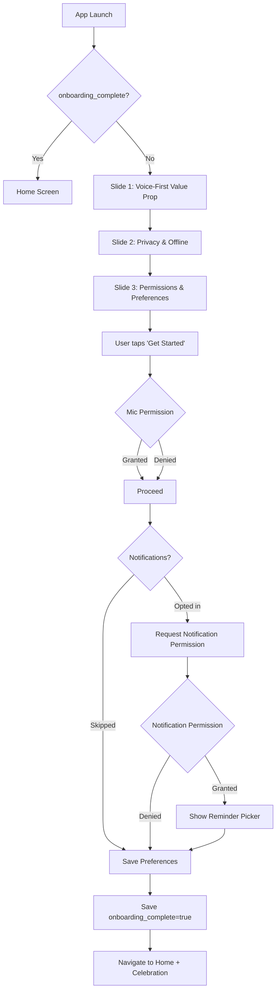
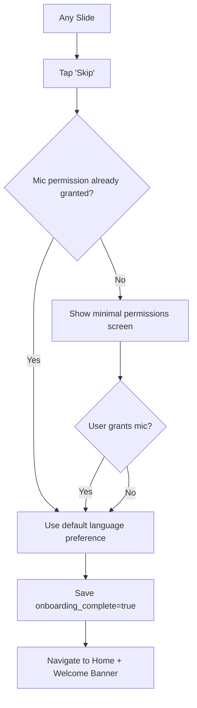
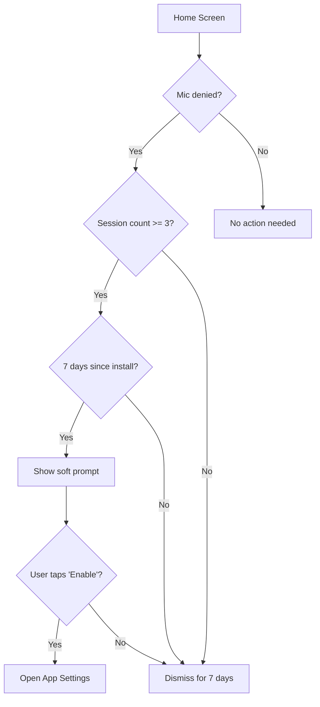

# Masroof (مصروف) — Onboarding Flow

**Business Requirements Document (BRD)**

| Document Control | |
|---|---|
| **Document ID** | BRD-002 |
| **Version** | 1.0 |
| **Status** | Draft for Review |
| **Date** | 2026-06-19 |
| **Author** | Product Team |
| **Classification** | Internal — Confidential |

**Change History**

| Version | Date | Author | Summary of Changes |
|---|---|---|---|
| 1.0 | 2026-06-19 | Product Team | Initial BRD for Onboarding flow |

---

## Table of Contents

1. [Executive Summary](#1-executive-summary)
2. [Business Context](#2-business-context)
3. [Target Audience](#3-target-audience)
4. [User Personas](#4-user-personas)
5. [Onboarding Goals & Success Metrics](#5-onboarding-goals--success-metrics)
6. [Functional Requirements](#6-functional-requirements)
7. [Non-Functional Requirements](#7-non-functional-requirements)
8. [User Flow](#8-user-flow)
9. [Screen-by-Screen Specification](#9-screen-by-screen-specification)
10. [Edge Cases & Error States](#10-edge-cases--error-states)
11. [Constraints & Dependencies](#11-constraints--dependencies)
12. [Appendices](#12-appendices)

---

## 1. Executive Summary

The onboarding flow is the **first experience** a user has with Masroof. For a voice-first finance app targeting the Egyptian market, onboarding must simultaneously:

1. **Demonstrate the core value proposition** in seconds — recording an expense by speaking naturally.
2. **Build trust** — financial data is deeply personal; users need to feel safe before they commit.
3. **Obtain critical permissions** (microphone, notifications) contextually and transparently.
4. **Establish language and localization preferences** — Arabic-first, RTL, Eastern Arabic numerals.
5. **Minimize drop-off** — every additional tap or second of friction is a leak in the funnel.

This document defines the complete business and functional requirements for the onboarding experience, covering a 3-slide carousel with permission gatekeeping, language selection, skip capability, and seamless transition into the main app. The onboarding is designed as a **one-time, skippable, device-local flow** that runs fully offline — no account creation, no server calls, no barriers to entry.

**Core principle:** The user should go from "installed" to "recorded first expense" in under 120 seconds (target: <90s median).

---

## 2. Business Context

### 2.1 Why Onboarding Matters for Voice-First Finance

Onboarding is the highest-leverage screen in any consumer app. For Masroof specifically:

| Factor | Impact | Source / Benchmark |
|---|---|---|
| **First-impression abandonment** | 25–40% of users abandon an app after one use if onboarding fails to demonstrate value | Industry UX benchmarks |
| **Permission opt-in rates** | Contextual permission requests (explaining *why* before *what*) increase grant rates by 30–50% | Google Play / App Store guidelines |
| **Finance app trust barrier** | 62% of users cite privacy concerns as the #1 reason for not adopting finance apps | Pew Research, 2025 |
| **Arabic-language UX gap** | Few finance apps offer a polished Arabic-first experience; users are accustomed to English-centric UIs | Market analysis |
| **Voice-first novelty** | Voice as a primary input for finance is unfamiliar to most users — they need a clear demonstration of value | Internal hypothesis |

### 2.2 The Trust Problem

Egyptian users, like users everywhere, are skeptical about financial apps — but several factors amplify this:

- **Microphone sensitivity:** Granting microphone access to a finance app raises immediate privacy questions. _"Is this app listening to me all the time?"_
- **Data residency concerns:** Users may worry about where their financial data is stored and who has access.
- **Local-first as a selling point:** The fact that all data stays on-device is a competitive differentiator — but it must be communicated during onboarding, not buried in a privacy policy.

### 2.3 The Voice-First Education Gap

Users who have never used a voice-first expense tracker need to understand:

- That they can speak naturally in **Arabic, English, or mixed** (code-switching).
- That the app understands colloquial Egyptian Arabic — not just formal Fus-ha.
- That the entire process takes **under 10 seconds**.
- That they can review and correct if the app misunderstands.

The onboarding must communicate all of this without overwhelming the user with text.

---

## 3. Target Audience

### 3.1 Primary Demographic

| Attribute | Detail |
|---|---|
| **Geography** | Egypt (Cairo, Alexandria, Giza as primary; secondary: other urban centers) |
| **Age** | 22–45 |
| **Tech literacy** | Mixed — from tech-savvy professionals to first-gen smartphone users |
| **Language** | Arabic-dominant; code-switching with English is common |
| **Income** | Middle to upper-middle class (household 10K–50K+ EGP/month) |
| **Smartphone OS** | Android 11+ (80%+ market share), iOS 16+ |

### 3.2 Key Behavioral Traits

- Makes 3–10 casual purchases daily (coffee, meals, transport, groceries, utilities)
- Has tried and **abandoned** at least one expense tracker or budgeting app before
- Uses WhatsApp voice notes daily — comfortable with voice as an interaction modality
- Concerned about data privacy but willing to share if the value proposition is clear
- Expects apps to "just work" — low tolerance for friction, loading screens, or registration walls

### 3.3 Cultural Considerations

| Factor | Implication for Onboarding |
|---|---|
| **RTL reading pattern** | All animations, transitions, and layouts must flow right-to-left |
| **Eastern Arabic numerals (٠١٢٣)** | Numerals throughout onboarding must use Eastern Arabic by default |
| **Cairo font** | Use Cairo typeface exclusively — do not fall back to system fonts |
| **Friday / Saturday weekend** | Notification timing defaults should reflect Egyptian workweek |
| **Privacy sensitivity** | Emphasize local-first / on-device processing prominently |
| **"Word of mouth" culture** | A positive first impression drives organic sharing — polish matters |

---

## 4. User Personas

### 4.1 Persona 1: Ahmed — The Skeptical Professional

> *"I don't trust apps with my money data. And I don't have time to learn a complicated system."*

| Attribute | Detail |
|---|---|
| **Age** | 34 |
| **Occupation** | Software engineer at a Cairo startup |
| **Tech literacy** | High — but skeptical of "AI" and "smart" features |
| **Device** | Samsung Galaxy A54 (Android 14) |
| **Language** | Arabic-dominant; codeswitches with English at work |
| **Key concern** | Microphone access + data privacy |
| **Onboarding need** | Must see clear, honest explanation of on-device processing. Wants to test the voice feature immediately. Will skip any screen that feels like "fluff." |
| **Success signal** | Records first expense within 60 seconds of opening the app and says _"That was actually easy."_ |

### 4.2 Persona 2: Noha — The Busy Working Parent

> *"I need to track spending but I never remember to open the app. If it takes more than a few seconds, I won't do it."*

| Attribute | Detail |
|---|---|
| **Age** | 41 |
| **Occupation** | Marketing manager, mother of two |
| **Tech literacy** | Moderate — comfortable with WhatsApp, Instagram, banking apps |
| **Device** | iPhone 13 (iOS 17) |
| **Language** | Arabic-dominant; prefers Arabic UI |
| **Key concern** | Time commitment — will abandon if onboarding > 2 minutes |
| **Onboarding need** | Fast, visual, minimal text. Must see the microphone button and understand it works like WhatsApp voice notes. Wants to set reminders so she doesn't forget. |
| **Success signal** | Completes onboarding, grants microphone permission, sets one reminder slot, and records her first expense on day one. |

### 4.3 Persona 3: Karim — The University Student

> *"I've tried three expense trackers already. They all start fun then I stop using them after a week."*

| Attribute | Detail |
|---|---|
| **Age** | 20 |
| **Occupation** | Engineering student at Alexandria University |
| **Tech literacy** | High — uses multiple apps daily, comfortable with new tech |
| **Device** | Redmi Note 12 (Android 13) |
| **Language** | Arabic/English equally; uses English app UIs by default but open to Arabic |
| **Key concern** | "Is this actually useful or just a gimmick?" Wants to see value fast |
| **Onboarding need** | Engaging visuals, clear value prop. Open to trying voice but needs to be convinced it's faster than typing. Might prefer English UI initially. |
| **Success signal** | Completes onboarding, grants all permissions, and records an expense on day one. Returns on day 3. |

---

## 5. Onboarding Goals & Success Metrics

### 5.1 Primary Goals

| Goal | Description |
|---|---|
| **G1 — Value demonstration** | User understands that Masroof lets them record expenses by speaking naturally in <10s |
| **G2 — Trust establishment** | User feels confident that their financial data and microphone are handled responsibly |
| **G3 — Permission acquisition** | User grants microphone (required) and notification (optional but encouraged) permissions |
| **G4 — Preference capture** | User's language preference (Arabic / English) and notification schedule are set |
| **G5 — Rapid time-to-value** | User records their first expense within 90 seconds (median) of first app open |

### 5.2 Success Metrics (KPIs)

| Metric | Definition | Target | Measurement |
|---|---|---|---|
| **Onboarding completion rate** | % of app opens that reach the final "Get Started" tap | >85% | Funnel analytics (slide 1 → slide 2 → slide 3 → complete) |
| **Microphone permission grant rate** | % of users who grant mic access when prompted | >75% | Platform permission API |
| **Notification permission grant rate** | % of users who grant notification access when prompted | >60% | Platform permission API |
| **Time to first recording** | Median seconds from first app open to first expense recorded | <90s | Analytics — session timing |
| **Onboarding skip rate** | % of users who tap "Skip" before reaching the final slide | <15% | Analytics — skip event |
| **Language selection completion** | % of users who complete language selection (vs. accepting default) | >90% | Analytics — language selection event |
| **Slide-to-slide swipe rate** | % of navigation that uses swipe vs. button tap | >50% (indicates engagement) | Touch analytics |
| **Drop-off per slide** | % of users who leave the app on each slide | Slide 1: <10%, Slide 2: <5%, Slide 3: <5% | Funnel analytics |

### 5.3 Counter-Metrics (Guardrails)

| Metric | Guardrail | Action if breached |
|---|---|---|
| **Permission denial without reason** | <5% of users who deny mic + notification without proceeding | Add in-app explanation screen before permission prompt |
| **Skip → never return** | <40% of skippers return within 7 days | Consider showing condensed onboarding on second launch |
| **Onboarding crash rate** | <0.1% of sessions | Blocking bug — P0 fix required |

---

## 6. Functional Requirements

### 6.1 Slide-Based Carousel

| ID | Requirement | Acceptance Criteria | Priority |
|---|---|---|---|
| REQ-ONB-1.1 | **3-slide carousel** — User progresses through 3 slides in sequence (swipe or button) | 1. Three slides defined: Slide 1 (Value Prop), Slide 2 (Privacy & Offline), Slide 3 (Permissions & Preferences)<br/>2. User can swipe left/right (RTL-aware) OR tap Next/Get Started button<br/>3. Swipe direction respects RTL: right-to-left for Arabic, left-to-right for English<br/>4. Carousel is paged — snaps to each slide (no free-scroll)<br/>5. Animations are smooth at 60fps on mid-range devices | P0 |
| REQ-ONB-1.2 | **Slide content structure** — Each slide has consistent layout: icon, title, description | 1. Icon area: circular container (`bg-primary/10`, `rounded-full`, ~96x96dp) with themed icon using `useThemeColors`<br/>2. Title: `Text` with `h2` variant, centered, uses `t('onboarding.slide1.title')`<br/>3. Description: `Text` with `muted` variant, centered, max width ~300dp<br/>4. Consistent vertical spacing between elements (gap-8 or 32dp)<br/>5. No scroll needed — content fits in one viewport | P0 |
| REQ-ONB-1.3 | **Dot indicators** — Animated dots showing current slide position | 1. Row of 3 dots centered below content<br/>2. Active dot: `w-8 h-2 rounded-full bg-primary` (wider, primary color)<br/>3. Inactive dots: `w-2 h-2 rounded-full bg-primary/20` (smaller, faded)<br/>4. Dot transition animates smoothly (width/color interpolation)<br/>5. Dots are tappable? — **No**, navigation only via swipe or button (prevents confusion) | P0 |
| REQ-ONB-1.4 | **Skip button** — User can skip onboarding at any time | 1. "Skip" / "تخطي" link positioned top-right (or top-left in RTL)<br/>2. `Text` with `muted` variant, small font, tappable<br/>3. On tap: navigates directly to main app (Home screen)<br/>4. Skip is never penalized — skipped users can re-trigger onboarding from Settings (future)<br/>5. Skip button auto-hides on the last slide (replaced by Get Started) | P0 |
| REQ-ONB-1.5 | **Next / Get Started button** — Primary CTA at bottom | 1. `Button` component with `default` variant, full-width (`className="h-12 rounded-xl"`)<br/>2. Text: `t('onboarding.next')` on slides 1–2, `t('onboarding.getStarted')` on slide 3<br/>3. On tap: advances to next slide (slides 1–2) or completes onboarding (slide 3)<br/>4. Button has a subtle scale animation on press (haptic feedback on Android/iOS)<br/>5. Button is disabled briefly (300ms) after tap to prevent double-fire | P0 |

### 6.2 Slide Content Definitions

#### Slide 1: Voice-First Value Prop

| Field | Arabic | English |
|---|---|---|
| **Icon** | `Ionicons` `mic` / `mic-circle` | Same |
| **Title** | "سجل مصروفاتك بصوتك" | "Record Expenses with Your Voice" |
| **Description** | "تكلم طبيعي — مصري أو إنجليزي أو الاتنين مع بعض. التطبيق بيفهمك ويسجل في أقل من ١٠ ثواني." | "Speak naturally — Arabic, English, or mixed. The app understands and saves in under 10 seconds." |
| **Visual addition** | Optional animated microphone pulse (subtle scale loop) to demonstrate voice-input concept | Same |

#### Slide 2: Privacy & Offline (Trust Builder)

| Field | Arabic | English |
|---|---|---|
| **Icon** | `Ionicons` `shield-checkmark` / `lock-closed` | Same |
| **Title** | "بياناتك في أمان" | "Your Data Stays Private" |
| **Description** | "كل حاجة على جهازك — مش بنرفع حاجة على سيرفر. مش محتاج نت عشان تسجل. الخصوصية مش إعداد، دي أساس التطبيق." | "Everything stays on your device. No uploads to servers. No internet needed to record. Privacy isn't a setting — it's the foundation." |
| **Visual addition** | Simple illustration of phone with lock/shield motif; offline badge | Same |

#### Slide 3: Permissions & Preferences

| Field | Arabic | English |
|---|---|---|
| **Icon** | `Ionicons` `settings` / `options` | Same |
| **Title** | "جهز كل حاجة" | "Almost There!" |
| **Description** | "خلينا نضبط الميكروفون عشان نقدر نسجل، والإشعارات عشان متنساش." | "Let's set up the microphone so you can record, and notifications so you never forget." |
| **Additional elements** | Language toggle (Arabic/English), reminder schedule picker (optional) | Same |

### 6.3 Permission Requests

| ID | Requirement | Acceptance Criteria | Priority |
|---|---|---|---|
| REQ-ONB-2.1 | **Microphone permission — contextual prompt on Slide 3** | 1. Microphone permission is requested **after** the user has seen Slide 1 (value prop) and Slide 2 (privacy). Never on first launch.<br/>2. Before triggering the OS dialog, show an in-app explanation: "Masroof needs mic access so you can record expenses with your voice. No audio is ever uploaded."<br/>3. Only request after user taps "Get Started" on Slide 3.<br/>4. If granted: proceed to main app.<br/>5. If denied: proceed to main app with limited functionality (text-only mode). Show a banner on Home: "Enable microphone in Settings to use voice recording."<br/>6. On second launch, if mic was denied, show a one-time nudge: "Voice recording is the fastest way to track expenses. Would you like to enable it?" | P0 |
| REQ-ONB-2.2 | **Notification permission — optional, explained** | 1. Notifications are requested **after** microphone permission (or after onboarding if mic skipped).<br/>2. Before triggering OS dialog, show in-app explanation: "Masroof can remind you to log expenses so you never lose track. You choose when and how often."<br/>3. If granted: show reminder schedule picker (default times: بعد الغدا 1:30 PM, قبل النوم 9:30 PM).<br/>4. If denied: proceed silently — no banner, no nudge. Notifications can be enabled later from Settings.<br/>5. Notification permission is optional — not blocking for any core functionality. | P1 |
| REQ-ONB-2.3 | **Permission re-prompt policy** | 1. If user denies a permission during onboarding, do NOT re-prompt during the same session.<br/>2. After 7 days of active use (≥3 sessions), if mic is still denied, show a soft prompt on Home: "Mic access helps you record expenses faster. Enable in Settings?" with "Not now" / "Go to Settings" options.<br/>3. If user has denied twice total, never re-prompt automatically (user must manually enable in Settings).<br/>4. Follow platform guidelines: no custom "don't ask again" bypass. | P1 |

### 6.4 Language Preference Selection

| ID | Requirement | Acceptance Criteria | Priority |
|---|---|---|---|
| REQ-ONB-3.1 | **Language selector on Slide 3** | 1. Two toggle buttons or a segmented control: العربية (default) / English<br/>2. Default selection is based on device locale → Arabic for `ar-*` locales, English for others<br/>3. Tapping a language option immediately previews the UI in that language (hot-swap the visible strings)<br/>4. Selection persists via AsyncStorage and is read on every app launch<br/>5. Language can be changed later in Settings → Language | P0 |
| REQ-ONB-3.2 | **RTL/LTR switching** | 1. Layout direction is set based on selected language: RTL for Arabic, LTR for English<br/>2. On language toggle on Slide 3, layout direction switches immediately (with smooth transition if feasible)<br/>3. All components respect the `DirectionProvider` from `src/components/ui`<br/>4. Splash screen should also respect Arabic-first layout | P1 |
| REQ-ONB-3.3 | **Numeral preference** | 1. Numerals default to Eastern Arabic (٠١٢٣٤٥٦٧٨٩) when Arabic is selected<br/>2. Western numerals (0123) used when English is selected<br/>3. No standalone numeral toggle needed on onboarding (available in Settings later) | P1 |

### 6.5 Feature Intro (Voice Demo)

| ID | Requirement | Acceptance Criteria | Priority |
|---|---|---|---|
| REQ-ONB-4.1 | **Voice recording demo (optional enhancement)** | 1. On Slide 1, show a callout or tooltip: "Try it now — tap the mic and say a purchase."<br/>2. This triggers a one-time recording that does NOT save (sandbox mode — user can explore)<br/>3. After recording, show a success animation with mock transcription<br/>4. If user doesn't interact within 5 seconds, auto-advance tooltip to "You can do this anytime."<br/>5. **Implementation complexity:** Medium. Can be deferred to v1.1 if time-constrained. | P2 |

### 6.6 Onboarding Completion & Transition

| ID | Requirement | Acceptance Criteria | Priority |
|---|---|---|---|
| REQ-ONB-5.1 | **Completion action** | 1. When user taps "Get Started" (or "هيا بنا"):<br/>   a. If mic not yet granted → trigger mic permission flow (REQ-ONB-2.1)<br/>   b. If notification not yet granted and user opted in → trigger notification permission flow (REQ-ONB-2.2)<br/>   c. Save language preference to AsyncStorage<br/>   d. Save reminder schedule (if configured) to local DB<br/>   e. Mark onboarding as complete in AsyncStorage (`onboarding_complete: true`)<br/>2. Navigate to Home screen with a **celebratory micro-animation** (confetti or scale-in of mic button) | P0 |
| REQ-ONB-5.2 | **Post-onboarding redirect** | 1. After completion, Home screen is shown with the microphone button prominently displayed<br/>2. First-time Home screen shows a subtle tooltip: "Tap the mic to record your first expense" (auto-dismisses after 8 seconds or on first tap)<br/>3. If user skipped onboarding, Home screen shows a condensed banner: "Tap the mic to record expenses with your voice" for first 3 sessions | P0 |
| REQ-ONB-5.3 | **One-time flow — not repeatable** | 1. On subsequent app launches, check `onboarding_complete` flag in AsyncStorage<br/>2. If true → skip onboarding entirely, go directly to Home<br/>3. If false → show onboarding (e.g., fresh install or data clear)<br/>4. No "replay onboarding" mechanism in MVP (can be added later from Settings) | P0 |

### 6.7 Animations & Transitions

| ID | Requirement | Acceptance Criteria | Priority |
|---|---|---|---|
| REQ-ONB-6.1 | **Slide transitions** | 1. Slides transition with a smooth horizontal translate animation (use `react-native-reanimated` or Expo's built-in animated API)<br/>2. Duration: 300–400ms per transition<br/>3. Easing: ease-in-out curve<br/>4. Content fades in subtly (opacity 0 → 1) on each new slide<br/>5. Swipe gesture feels responsive — no delay between touch and movement | P0 |
| REQ-ONB-6.2 | **Icon animation** | 1. The icon on each slide animates in on mount (scale 0.8 → 1.0 + opacity 0 → 1)<br/>2. Loop animation for Slide 1 mic icon: subtle pulse (scale 1.0 ↔ 1.05) to suggest voice interaction<br/>3. Use `Animated` from React Native or `react-native-reanimated` — avoid `Lottie` to keep bundle size small | P1 |
| REQ-ONB-6.3 | **Button press feedback** | 1. Button scales to 0.97 on press-in, returns to 1.0 on press-out<br/>2. Haptic feedback: `ImpactFeedbackStyle.Light` on Android, `notificationOccurred(.success)` on iOS<br/>3. Duration: 100ms scale, instant haptic | P1 |

### 6.8 Accessibility

| ID | Requirement | Acceptance Criteria | Priority |
|---|---|---|---|
| REQ-ONB-7.1 | **Screen reader support** | 1. All interactive elements have `accessibilityLabel` and `accessibilityRole`<br/>2. Slide content is read aloud when slide becomes active<br/>3. Dot indicators have accessibility hint: "Slide X of 3"<br/>4. Skip button labeled: "Skip onboarding"<br/>5. Language toggle labeled: "Select Arabic" / "Select English" | P1 |
| REQ-ONB-7.2 | **Font scaling** | 1. All text respects system font size settings (Dynamic Type / Accessibility)<br/>2. Minimum tap target size: 44x44dp for all tappable elements<br/>3. No text truncation at maximum font sizes — layout must accommodate | P1 |

---

## 7. Non-Functional Requirements

| ID | Requirement | Target | Priority |
|---|---|---|---|
| NFR-ONB-1 | **Cold start → first slide visible** | <1.5s on mid-range device (Redmi Note 12) | P0 |
| NFR-ONB-2 | **Slide transition smoothness** | 60fps, no jank on mid-range devices | P0 |
| NFR-ONB-3 | **Offline operation** | Onboarding runs 100% offline — no network calls, no loading spinners | P0 |
| NFR-ONB-4 | **No blocking account creation** | User can complete onboarding without email, phone, or any personal identifier | P0 |
| NFR-ONB-5 | **Memory footprint** | Onboarding should not increase app memory by >50MB over baseline | P1 |
| NFR-ONB-6 | **Accessibility** | WCAG AA for all text contrast ratios; full TalkBack/VoiceOver support | P1 |
| NFR-ONB-7 | **Animation graceful degradation** | If device has "Reduce Motion" enabled, use crossfade instead of slide transitions | P1 |
| NFR-ONB-8 | **RTL layout compliance** | 100% of onboarding screens render correctly in RTL with no layout clipping | P0 |
| NFR-ONB-9 | **Localization coverage** | All user-facing strings use `t()` from `react-i18next`; zero hardcoded strings | P0 |
| NFR-ONB-10 | **Crash-free session rate** | >99.9% during onboarding flow | P0 |
| NFR-ONB-11 | **Data persistence** | Language preference and onboarding_complete flag persist across app restarts and upgrades | P0 |

---

## 8. User Flow

### 8.1 Main Onboarding Flow (Happy Path)



### 8.2 Skip Flow



### 8.3 Permission Re-Prompt Flow (Post-Onboarding)



---

## 9. Screen-by-Screen Specification

### 9.1 Slide 1 — Voice-First Value Prop

**Layout:**

```
┌──────────────────────────────────────┐
│                    [Skip/تخطي]       │  ← top-right (RTL: top-left)
│                                      │
│                                      │
│            ┌──────────┐              │
│            │  🎤 Icon  │             │  ← 96x96dp circle, bg-primary/10
│            │  (pulse)  │             │
│            └──────────┘              │
│                                      │
│     سجل مصروفاتك بصوتك              │  ← h2, centered
│                                      │
│  تكلم طبيعي — مصري أو إنجليزي...   │  ← muted, centered, max-w-[300]
│                                      │
│                                      │
│          ● ● ●                       │  ← dot indicators
│                                      │
│  ┌──────────────────────────┐        │
│  │        التالي / Next      │        │  ← Button, full-width
│  └──────────────────────────┘        │
└──────────────────────────────────────┘
```

**Key behaviors:**
- Mic icon pulses subtly (scale 1.0 ↔ 1.05) to suggest voice interaction
- Skip button is visible
- Swipe right (in RTL) advances to Slide 2

### 9.2 Slide 2 — Privacy & Offline (Trust Builder)

**Layout:**

```
┌──────────────────────────────────────┐
│                    [Skip/تخطي]       │
│                                      │
│            ┌──────────┐              │
│            │ 🛡️ Icon  │             │  ← shield-checkmark / lock-closed
│            └──────────┘              │
│                                      │
│        بياناتك في أمان              │  ← h2, centered
│                                      │
│  كل حاجة على جهازك — مش بنرفع...   │  ← muted, centered
│                                      │
│          ● ● ●                       │
│                                      │
│  ┌──────────────────────────┐        │
│  │        التالي / Next      │        │
│  └──────────────────────────┘        │
└──────────────────────────────────────┘
```

**Key behaviors:**
- Same layout structure as Slide 1 (consistent rhythm)
- Lock/shield icon — consider `Ionicons` `shield-checkmark` or `lock-closed`
- No new interactive elements
- Swipe right (RTL) advances to Slide 3; swipe left returns to Slide 1

### 9.3 Slide 3 — Permissions & Preferences

**Layout:**

```
┌──────────────────────────────────────┐
│                    [Skip/تخطي]       │
│                                      │
│            ┌──────────┐              │
│            │ ⚙️ Icon  │             │  ← settings / options icon
│            └──────────┘              │
│                                      │
│        جهز كل حاجة                  │  ← h2, centered
│                                      │
│   خلينا نضبط الميكروفون...         │  ← muted, centered
│                                      │
│   ┌─────────────────────────────┐   │
│   │  العربية     │   English    │   │  ← Segmented control / toggle
│   └─────────────────────────────┘   │
│                                      │
│   🔔 ذكرني بعد الغدا (اختياري)    │  ← Optional reminder toggle
│                                      │
│          ● ● ●                       │
│                                      │
│  ┌──────────────────────────┐        │
│  │     هيا بنا / Let's Go    │        │  ← Button, full-width
│  └──────────────────────────┘        │
└──────────────────────────────────────┘
```

**Key behaviors:**
- Language toggle immediately switches UI language + layout direction
- Optional reminder toggle expands to show time picker
- "Get Started" triggers permission requests (see Section 6.3)
- Swipe left returns to Slide 2; no forward swipe (carousel ends)

---

## 10. Edge Cases & Error States

### 10.1 Permission-Related Edge Cases

| Scenario | Handling | Expected Behavior |
|---|---|---|
| **Microphone denied permanently** (iOS: "Don't Allow" twice, Android: "Never ask again") | App proceeds to Home in text-only mode | Show persistent but non-blocking banner: "Enable mic in Settings for voice recording" with a "Go to Settings" button. Banner auto-dismisses after 5 seconds on first 3 sessions, then reduces to a small icon indicator. |
| **Notification denied** | App proceeds silently | No banner, no disruption. Feature can be enabled later from Settings. |
| **Microphone permission revoked mid-session** (user goes to Settings) | On app resume, check permission status | If revoked: show "Mic access was turned off. Voice recording is unavailable." banner on Home. Do NOT crash or loop. |
| **Both permissions denied** | App proceeds in text-only, no-notifications mode | All core functionality (text entry, history, analytics) works. Voice and reminders are disabled gracefully. |
| **Permission request timing conflict** (iOS: both dialogs at once) | Request mic first, then notifications sequentially | Never request two permissions simultaneously. OS may only show one dialog; the second would auto-deny. Handle: if notification auto-denied, treat as user choice — no re-prompt. |

### 10.2 Interaction Edge Cases

| Scenario | Handling |
|---|---|
| **Rapid tapping on Next** | Button disabled for 300ms after each tap (`disabled` prop + timer). Prevents double-fire and double-navigation. |
| **Rapid tapping on Skip** | Skip navigates to Home immediately. Rapid taps are idempotent — only one navigation event fires. |
| **User swipes while slide transition is in progress** | Ignore input during active transition (300ms lockout). After transition completes, input is re-enabled. |
| **User leaves app mid-onboarding** | Onboarding progress is not saved. Next launch restarts from Slide 1. (Onboarding is <30s to complete — restarting is acceptable.) |
| **"Reduce Motion" accessibility setting enabled** | Detect via `useReducedMotion()` from React Native. Disable slide animations; use instant crossfade or no animation. Disable mic pulse loop. |
| **Very large font sizes** (Accessibility) | Layout must not break. Text wraps; container height adjusts. No overflow or truncation. |
| **App crash during permission request** | On next launch, onboarding state is `onboarding_complete: false`. Restart from Slide 1. Permission state persists from OS — may already be granted. |
| **Device rotates during onboarding** | Onboarding is portrait-locked. Do not implement rotation handling. |

### 10.3 Technical Edge Cases

| Scenario | Handling |
|---|---|
| **AsyncStorage unavailable / corrupted** | Default language: Arabic. Default `onboarding_complete`: false. Onboarding proceeds normally. On first save, attempt to repair AsyncStorage. |
| **RTL + LTR mixed content** (e.g., English app name in Arabic description) | Use `DirectionProvider` for overall layout. Individual text elements use standard Unicode bidi algorithm. Test with Arabic text containing English brand names. |
| **System language is neither Arabic nor English** (e.g., French) | Default to Arabic (Masroof's primary market is Egypt). User can switch to English via language toggle. |
| **Legacy device without microphone** (Android tablet) | Detect via `Permissions` API. Hide voice-first slide content? Instead: show text-entry value prop. App still fully functional. |
| **Onboarding completed → data wipe** | If AsyncStorage cleared, `onboarding_complete` flag is lost. On next launch, user sees onboarding again. This is acceptable behavior. |

### 10.4 Error States

| Error | UX Handling |
|---|---|
| **Slide image/icon fails to load** | Icon is a hardcoded vector component (`Ionicons` / `MaterialIcons`) — no network dependency. Should never fail. |
| **Haptic feedback unavailable** | Wrap haptic calls in try-catch. Fail silently — no UX impact. |
| **Animation frame drops** | If frame rate drops below 30fps for >200ms, disable non-essential animations (pulse loop) for the session. Detect via `InteractionManager` or framerate monitoring. |

---

## 11. Constraints & Dependencies

### 11.1 Technical Constraints

| Constraint | Implication |
|---|---|
| **Expo SDK 56 + React Native** | Must use Expo-compatible animation libraries (e.g., `react-native-reanimated` if bundled, or RN `Animated`). Avoid native modules that require ejecting. |
| **No account creation in MVP** | Onboarding is fully anonymous — no email, phone, or password. Language/reminder preferences stored in AsyncStorage + SQLite only. |
| **No Lottie animations in MVP** | Keep bundle size small by using built-in RN `Animated` or `react-native-reanimated` for all animations. Lottie files add ~500KB+ per animation. |
| **Offline-first requirement** | Zero network calls during onboarding. No analytics SDK calls that require connectivity. Batch analytics events and flush later. |
| **NativeWind / Tailwind CSS** | All styling uses NativeWind classes and theme tokens from `global.css`. No inline `StyleSheet.create` with hex colors. |

### 11.2 Design Dependencies

| Dependency | Notes |
|---|---|
| **Theme tokens** | Use `bg-primary`, `text-primary`, `bg-primary/10`, `text-on-surface`, `text-muted-foreground`, `bg-background`, `text-on-primary` from global.css |
| **Cairo font** | Cairo-Regular for body, Cairo-Bold for titles (`font-cairo`, `font-cairo-bold`) |
| **RTL layout** | `DirectionProvider` wrapping root layout in `_layout.tsx` |
| **Button component** | Use `src/components/ui/button.tsx` with `default` variant |
| **Text component** | Use `src/components/ui/text.tsx` with `h2`, `muted` variants |
| **useThemeColors** | For imperatively set icon colors: `const colors = useThemeColors()` |

### 11.3 Localization Dependencies

| Dependency | Notes |
|---|---|
| **i18n namespace** | Add `onboarding` namespace to `src/i18n/locales/{ar,en}/translations.json` |
| **Translation keys required** | See Appendix A for full key list |
| **RTL testing** | Must verify all slides with Arabic content in RTL layout on both iOS Simulator and Android Emulator |

### 11.4 Platform Constraints

| Platform | Constraint |
|---|---|
| **iOS 16+** | Minimum target. iOS permission dialogs cannot be customized beyond the explanation string set in `Info.plist` via `expo-constants`. |
| **Android 11+ (API 30)** | Minimum target. Android permission dialogs cannot be customized; use `shouldShowRequestPermissionRationale` for re-prompts. |
| **Notch / Dynamic Island** | Safe area must be respected: use `SafeAreaView` from `src/components/layout/SafeAreaView.tsx` |
| **Device orientation** | Portrait-locked for onboarding flow |

### 11.5 Third-Party Dependencies

| Dependency | Usage | Risk |
|---|---|---|
| `expo-tracking-transparency` | Not needed — Masroof does not track users. Do not install. | N/A |
| `expo-notifications` | For notification permission and reminder scheduling | Low — well-established Expo module |
| `expo-haptics` | For button press feedback | Low — small module, no native build issues |
| `@react-native-async-storage/async-storage` | For `onboarding_complete` flag and language preference | Low — core Expo dependency |

---

## 12. Appendices

### 12.1 Appendix A: Translation Keys (i18n)

Add the following keys under a new `onboarding` namespace in both `ar/translations.json` and `en/translations.json`:

| Key | Arabic | English |
|---|---|---|
| `onboarding.skip` | تخطي | Skip |
| `onboarding.next` | التالي | Next |
| `onboarding.getStarted` | هيا بنا | Get Started |
| `onboarding.slide1.title` | سجل مصروفاتك بصوتك | Record Expenses with Your Voice |
| `onboarding.slide1.description` | تكلم طبيعي — مصري أو إنجليزي أو الاتنين مع بعض. التطبيق بيفهمك ويسجل في أقل من ١٠ ثواني. | Speak naturally — Arabic, English, or mixed. The app understands and saves in under 10 seconds. |
| `onboarding.slide2.title` | بياناتك في أمان | Your Data Stays Private |
| `onboarding.slide2.description` | كل حاجة على جهازك — مش بنرفع حاجة على سيرفر. مش محتاج نت عشان تسجل. الخصوصية مش إعداد، دي أساس التطبيق. | Everything stays on your device. No uploads to servers. No internet needed to record. Privacy isn't a setting — it's the foundation. |
| `onboarding.slide3.title` | جهز كل حاجة | Almost There! |
| `onboarding.slide3.description` | خلينا نضبط الميكروفون عشان نقدر نسجل، والإشعارات عشان متنساش. | Let's set up the microphone so you can record, and notifications so you never forget. |
| `onboarding.language.ar` | العربية | Arabic |
| `onboarding.language.en` | English | English |
| `onboarding.reminder.toggle` | ذكرني بتسجيل المصروفات | Remind me to record expenses |
| `onboarding.reminder.afterLunch` | بعد الغدا (١:٣٠ م) | After lunch (1:30 PM) |
| `onboarding.reminder.beforeBed` | قبل النوم (٩:٣٠ م) | Before bed (9:30 PM) |
| `onboarding.reminder.evening` | بالليل (٧:٠٠ م) | Evening (7:00 PM) |
| `onboarding.mic.explanation` | مصروفي محتاج الميكروفون عشان تسجل مصروفاتك بصوتك. مفيش تسجيل بينرفع لسيرفر. | Masroof needs mic access so you can record expenses with your voice. No audio is ever uploaded. |
| `onboarding.notif.explanation` | مصروفي يقدر يذكرك عشان متنساش تسجل. انت اللي تختار الوقت والعدد. | Masroof can remind you to log expenses so you never lose track. You choose when and how often. |
| `onboarding.mic.deniedBanner` | فعل الميكروفون من الإعدادات عشان تقدر تسجل بصوتك | Enable microphone in Settings to use voice recording |
| `onboarding.mic.deniedPrompt` | التسجيل بالصوت أسرع طريقة عشان تتبع مصروفاتك. عايز تفعله؟ | Voice recording is the fastest way to track expenses. Would you like to enable it? |
| `onboarding.completed.tooltip` | اضغط على الميكروفون عشان تسجل أول مصروف | Tap the mic to record your first expense |
| `onboarding.skipped.banner` | اضغط على الميكروفون عشان تسجل مصروفاتك بصوتك | Tap the mic to record expenses with your voice |

### 12.2 Appendix B: Component Hierarchy

```
OnboardingScreen
├── SafeAreaView (bg-background flex-1)
│   ├── SkipButton (top-right, muted text, hidden on last slide)
│   ├── AnimatedView (slide container, horizontal translate)
│   │   ├── SlideContent (per slide)
│   │   │   ├── IconCircle (96dp, bg-primary/10, rounded-full, flex-center)
│   │   │   │   └── Ionicons / MaterialIcons (color=colors.primary)
│   │   │   ├── Title (Text variant="h2", centered)
│   │   │   └── Description (Text variant="muted", centered, max-w-[300])
│   │   └── [Slide 3 extras]
│   │       ├── LanguageToggle (segmented control: العربية | English)
│   │       └── ReminderToggle (optional, with time picker)
│   ├── DotIndicators (row, 3 dots, animated active width)
│   └── NextButton (Button variant="default", full-width, h-12)
```

### 12.3 Appendix C: Key Implementation Decisions

| Decision | Recommended Approach | Rationale |
|---|---|---|
| **Navigation:** Carousel vs. pager | Horizontal `ScrollView` with `pagingEnabled` + `snapToInterval` | Simplest implementation. Avoids heavy dependencies like `react-native-pager-view`. Works reliably with RTL. |
| **Animation library** | React Native `Animated` API | Sufficient for slide translate, dot interpolation, and icon pulse. Avoids adding `react-native-reanimated` if not already in the project (check first). |
| **Permission flow** | Sequential: Mic → Notifications | Never request both at once. OS limitations on iOS means second dialog may not show. |
| **State management** | Local `useState` for active slide + `useRef` for animation values | Onboarding is a linear, non-interleaved flow. No need for global state (Zustand/Redux). |
| **i18n detection** | AsyncStorage → device locale → Arabic default | AsyncStorage read is fast (<5ms). Device locale fallback is reasonable for MVP. |

### 12.4 Appendix D: Current State vs. Target State

| Aspect | Current (`src/screens/onBoarding.tsx`) | Target |
|---|---|---|
| **Number of slides** | 3 (generic) | 3 (Masroof-specific) |
| **Content** | English-only, generic task management text | Arabic-first with English option, specific to voice expense tracking |
| **Design system** | Raw `className`, hardcoded colors | Token-based (`bg-primary/10`, `text-muted-foreground`, etc.) |
| **Icons** | Hardcoded `color="black"` | Themed via `useThemeColors().primary` |
| **i18n** | None — hardcoded strings | All strings via `t()` from `react-i18next` |
| **RTL support** | None — LTR only | Full RTL via `DirectionProvider` |
| **Permissions** | None | Contextual mic + notification permission requests |
| **Language selection** | None | Arabic/English toggle on Slide 3 |
| **Animations** | None | Slide transitions, dot animation, icon pulse |
| **Skip behavior** | Jumps to last slide | Navigates to Home with minimal settings |
| **Completion storage** | None | AsyncStorage `onboarding_complete` flag |
| **Edge case handling** | None | Comprehensive (rapid tap, permission denial, reduce motion, etc.) |

---

*End of Document — BRD-002: Masroof Onboarding Flow*

---

**Document Sign-off**

| Role | Name | Signature | Date |
|---|---|---|---|
| Product Manager | | | |
| Engineering Lead | | | |
| Design Lead | | | |
| QA Lead | | | |
